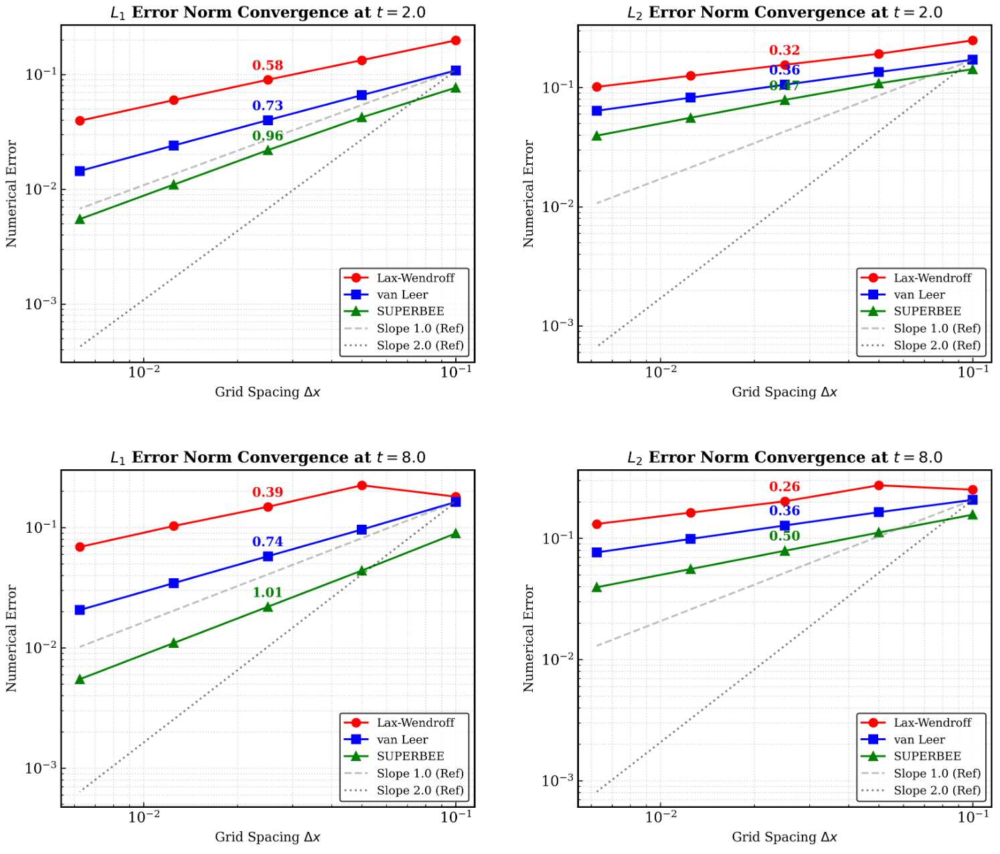
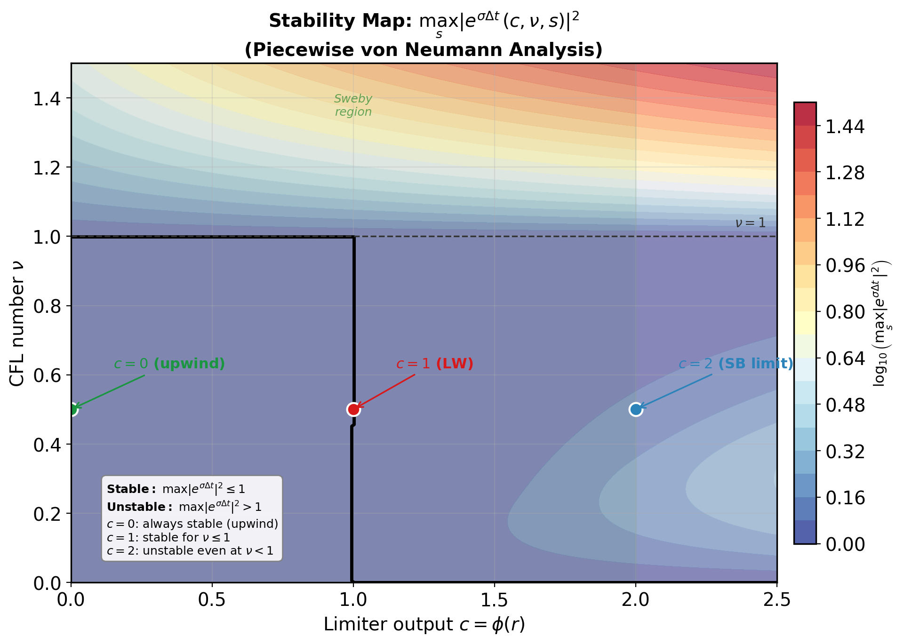
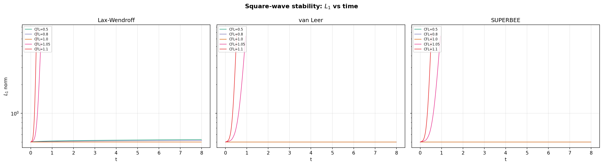
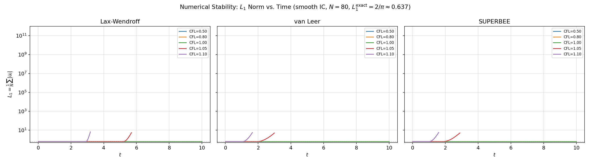

# Part I — 一维线性对流方程数值求解

第8组
12532299 梁祝旸
12310744 王雨禾

---

## 1. 数值格式的实现与解的对比

### 1.1 数值方法

求解一维线性对流方程：

$$\frac{\partial u}{\partial t} + a\frac{\partial u}{\partial x} = 0, \quad a = 1 \tag{1.1}$$

周期域 $x \in [-1, 1]$，初值为方波：

$$u(x,0) = \begin{cases} 1.0, & -0.5 < x < 0.5 \\ 0.0, & \text{otherwise} \end{cases} \tag{1.2}$$

**网格参数：** $N = 160$，$\Delta x = 2/N = 0.0125$。网格中心坐标 $x_i = (i-0.5)\Delta x - 1$。

**CFL 数设计：** 显式 MUSCL 格式的线性稳定条件为 $\nu \leq 1$。取 $\nu = a\Delta t/\Delta x = 0.8$，在稳定性和计算效率之间取得平衡。此时 $\Delta t = \nu \Delta x / a = 0.01$。

> **代码位置：** 网格参数和 CFL 定义见 `linear_advection.f90` 第 17–28 行；方波初始条件见第 50–56 行；网格坐标见第 46–48 行。

**统一推进公式：**

将 MUSCL 格式的原始表达式重新整理，将所有与 $\delta_j$ 无关的项合并，得到以下形式：

$$u_j^{n+1} = u_j^n - \nu(u_j^n - u_{j-1}^n) - \frac{\nu(1-\nu)}{2}(\delta_j - \delta_{j-1}) \tag{1.3}$$

其中 $\delta_j = \sigma_j \Delta x$ 为单元 $j$ 的斜率。写成这一形式的目的，是让三种格式仅通过 $\delta_j$ 即可区分——推进公式本身保持不变，替换斜率定义即可调用同一 `advance` 子程序。三种格式的 $\delta_j$ 定义如下：

| 格式 | $\delta_j$ | 限制器 $\phi(r)$ |
|:---:|:---:|:---:|
| Lax-Wendroff | $u_{j+1} - u_j$（下风斜率，无限制） | — |
| van Leer | $\phi_{VL}(r_j) \cdot (u_{j+1}-u_j)$ | $\phi_{VL}(r) = \frac{r+\lvert r\rvert}{1+\lvert r\rvert}$ |
| SUPERBEE | $\phi_{SB}(r_j) \cdot (u_{j+1}-u_j)$ | $\phi_{SB}(r) = \max(0, \min(2r,1), \min(r,2))$ |

其中 $r_j = (u_j - u_{j-1})/(u_{j+1} - u_j)$ 为局部斜率比。

> **代码位置：**
> - 统一时间推进子程序 `advance`：`linear_advection.f90` 第 156–173 行，实现公式 (3)
> - LW 斜率 `compute_delta_lw`：第 178–189 行，$\delta_j = u_{j+1} - u_j$
> - van Leer 斜率 `compute_delta_vl`：第 196–222 行，$\phi_{\text{VL}}(r) = (r+|r|)/(1+|r|)$
> - SUPERBEE 斜率 `compute_delta_sb`：第 229–255 行，$\phi_{\text{SB}}(r) = \max(0, \min(2r,1), \min(r,2))$
>
> 时间推进主循环（以 LW 为例）：第 72–88 行，每一步依次调用 `compute_delta_lw` → `advance` → 更新 `u`，并在采样步记录 TV

### 1.2 解析解

对于本问题，解析解为 $u(x,t) = u_0(x-at)$ 在周期域上的延拓。域长 $L = 2$，波速 $a=1$，波走完一圈需 $T = L/a = 2$。因此：
- $t = 2.0$：波平移 $2.0$ = 1 个周期长度 → 解与初值重合
- $t = 8.0$：波平移 $8.0$ = 4 个周期长度 → 解与初值重合

### 1.3 t = 2.0 时解的比较

> **代码位置：** t = 2.0 时输出解的语句见 `linear_advection.f90` 第 83 行（LW）、第 108 行（VL）、第 133 行（SB），均调用 `write_solution`（第 260–273 行），将 $x$、数值解 $u$ 和解析解 `u0` 写入 `.dat` 文件。`plot_results.py` 读取 `.dat` 文件生成此图。

**Lax-Wendroff 格式分析：**

LW 格式为二阶精度（Taylor 展开保留至 $\Delta t^2$），其修正方程的截断误差主项为：

$$\tau_{\text{LW}} = -\frac{a\Delta x^2}{6}(1-\nu^2)\frac{\partial^3 u}{\partial x^3} + \mathcal{O}(\Delta x^3) \tag{1.4}$$

主导误差为**三阶色散项** $\partial^3 u/\partial x^3$。间断可视为所有频率 Fourier 分量的叠加——不同波数的分量在 LW 格式下以不同的数值相速度传播（色散），高频分量在间断前后堆积，形成波长约 $2\Delta x$ 的 Gibbs 型振荡。图中清晰可见 LW 解在间断两侧出现 ±0.19 的振荡。

LW 格式无偶数阶耗散项——这正是 LW 设计的精妙之处（抵消了 $\partial^2 u/\partial x^2$ 项实现二阶精度），但也意味着格式缺乏抑制高频振荡的机制。这一现象在 Godunov 定理中有更深层的解释：**单调的线性格式至多为一阶精度**。LW 是二阶线性格式，因此必定不单调。

**van Leer 和 SUPERBEE：** 两者均无振荡，解严格保持在 $[0, 1]$ 范围内。van Leer 的间断过渡约 7 个网格，SUPERBEE 约 5 个网格，后者更锐利。

### 1.4 t = 8.0 时解的比较

经过 4 个周期的对流（800 时间步），LW 的振荡持续存在且幅度略有增长（min = −0.214, max = 1.214），而 van Leer 和 SUPERBEE 保持完全单调，证明其 TVD 性质的长期稳定性。

---

## 2. 全变差分析与格式评价

### 2.1 全变差定义（Total Variasion）

$$\text{TV}(u) = \sum_{\text{all } i} |u_{i+1} - u_i| \tag{2.1}$$

周期域上求和含卷绕项 $|u_1 - u_N|$。对单调初值，解析解的 TV 在时间演化中保持恒定。

> **代码位置：** TV 计算子程序见 `linear_advection.f90` 第 278–289 行：循环累加 $|u_{i+1}-u_i|$（第 285–287 行），最后加卷绕项 $|u_1 - u_N|$（第 288 行）。

### 2.2 TV 时间历程

TV 时间序列的计算和输出直接在每种格式的主时间循环内完成：TV 在 t=0 时记录初值，之后每 `tv_skip` 步（`max(1, nsteps2/500)`）调用 `total_variation` 记录一次，写入各格式的临时文件（`tv_lw_temp.dat`、`tv_vl_temp.dat`、`tv_sb_temp.dat`）。三个临时文件最后由 `merge_tv_files` 子程序合并为 `total_variation.dat`。相关代码见 `linear_advection.f90` 第 65–149 行（三个主循环中的 TV 内联记录）和第 294–318 行（`merge_tv_files` 合并子程序）。

> **代码位置：** `plot_results.py` 读取 `total_variation.dat` 生成此图。

| 格式 | TV(t=0) | TV(t=2.0) | TV(t=8.0) | 单调？ |
|:---:|:---:|:---:|:---:|:---:|
| Lax-Wendroff | 2.00 | 3.14 | 3.56 | ✗ |
| van Leer | 2.00 | 2.00 | 2.00 | ✓ |
| SUPERBEE | 2.00 | 2.00 | 2.00 | ✓ |

### 2.3 三种格式的评价

**Lax-Wendroff：**
- 优势：在光滑区域达到二阶精度（$\mathcal{O}(\Delta x^2, \Delta t^2)$），无一阶耗散误差
- 劣势：间断附近产生色散振荡，TV 随时间持续增长（t=0→2→8：2.00→3.14→3.56），**非 TVD 格式**
- 适用场景：光滑解问题；不宜用于含激波/间断的问题

**van Leer：**
- 优势：TVD 格式（TV = 2.00 不变），单调无振荡；限制器光滑可微，收敛性好；在光滑区恢复二阶精度
- 劣势：间断分辨率中等（~7 格过渡），极值点局部降为一阶
- 适用场景：稳健的全能型格式，适合大多数可压缩流问题

**SUPERBEE：**
- 优势：TVD 格式，在所有 TVD 限制器中间断分辨率最高（~5 格过渡）
- 劣势：限制器在 $r=1/2$ 和 $r=2$ 处不可导；可能在光滑极值附近产生轻微阶梯效应；$L_\infty$ 误差略大于 van Leer
- 适用场景：对间断分辨率有极高要求的可压缩流问题

---

## 3. 精度阶数分析

### 3.1 理论分析 — Taylor 展开与修正方程法

**方法总述：** 精度阶数的理论分析分为三步——(1) 将差分格式中所有项在 $(x_j, t^n)$ 处 Taylor 展开；(2) 利用原 PDE 将时间导数替换为空间导数；(3) 整理得到**修正方程**（modified equation），最低阶余项的 $\Delta x$ 幂次即为格式精度的阶数。

修正方程的形式为：

$$\frac{\partial u}{\partial t} + a\frac{\partial u}{\partial x} = \underbrace{\text{数值误差项}}_{\text{最低阶 $\Delta x$ 幂次决定精度阶数}} \tag{3.1}$$

以统一 MUSCL 格式为出发点：

$$u_j^{n+1} = u_j^n - \nu(u_j^n - u_{j-1}^n) - \frac{\nu(1-\nu)}{2}(\delta_j - \delta_{j-1}), \quad \nu = \frac{a\Delta t}{\Delta x} \tag{3.2}$$

---

#### 3.1.1 Lax-Wendroff 格式的完整推导

**Step 1 — 将 $\delta_j^{\text{LW}} = u_{j+1} - u_j$ 代入统一框架：**

$$\begin{aligned} u_j^{n+1} &= u_j - \nu(u_j - u_{j-1}) - \frac{\nu(1-\nu)}{2}\big[(u_{j+1}-u_j) - (u_j-u_{j-1})\big] \\ &= u_j - \frac{\nu}{2}(u_{j+1} - u_{j-1}) + \frac{\nu^2}{2}(u_{j+1} - 2u_j + u_{j-1}) \end{aligned} \tag{3.3}$$

这就是经典 Lax-Wendroff 两步形式。

**Step 2 — Taylor 展开所有项（以 $(x_j, t^n)$ 为中心，记 $u = u(x_j, t^n)$，下标表示偏导数）：**

时间方向：

$$u_j^{n+1} = u + \Delta t \cdot u_t + \frac{\Delta t^2}{2}u_{tt} + \frac{\Delta t^3}{6}u_{ttt} + \mathcal{O}(\Delta t^4) \tag{3.4}$$

空间方向（前向和后向）：

$$\begin{aligned} u_{j+1}^n &= u + \Delta x \cdot u_x + \frac{\Delta x^2}{2}u_{xx} + \frac{\Delta x^3}{6}u_{xxx} + \frac{\Delta x^4}{24}u_{xxxx} + \mathcal{O}(\Delta x^5) \\ u_{j-1}^n &= u - \Delta x \cdot u_x + \frac{\Delta x^2}{2}u_{xx} - \frac{\Delta x^3}{6}u_{xxx} + \frac{\Delta x^4}{24}u_{xxxx} + \mathcal{O}(\Delta x^5) \end{aligned} \tag{3.5}$$

由此构造格式中需要的差商组合：

$$\begin{aligned} \frac{u_{j+1} - u_{j-1}}{2\Delta x} &= u_x + \frac{\Delta x^2}{6}u_{xxx} + \mathcal{O}(\Delta x^4) \\ \frac{u_{j+1} - 2u_j + u_{j-1}}{\Delta x^2} &= u_{xx} + \frac{\Delta x^2}{12}u_{xxxx} + \mathcal{O}(\Delta x^4) \end{aligned} \tag{3.6}$$

**Step 3 — 代入格式并利用 PDE 消去时间导数：**

将 (T3) 代入 LW 格式，同时将 (T1) 放在等式左边：

$$\begin{aligned} u + \Delta t u_t + \frac{\Delta t^2}{2}u_{tt} + \frac{\Delta t^3}{6}u_{ttt} = u &- \nu\Delta x\left(u_x + \frac{\Delta x^2}{6}u_{xxx}\right) \\ &+ \nu^2\Delta x^2\left(\frac{1}{2}u_{xx} + \frac{\Delta x^2}{24}u_{xxxx}\right) \end{aligned} \tag{3.7}$$

两边消去 $u$，利用 $\nu\Delta x = a\Delta t$ 和 $\nu^2\Delta x^2 = a^2\Delta t^2$，除以 $\Delta t$：

$$u_t + \frac{\Delta t}{2}u_{tt} + \frac{\Delta t^2}{6}u_{ttt} = -a\,u_x - \frac{a\Delta x^2}{6}u_{xxx} + \frac{a^2\Delta t}{2}u_{xx} + \frac{a^2\Delta t\Delta x^2}{24}u_{xxxx} + \cdots \tag{3.8}$$

现在利用 PDE 将时间导数转为空间导数。由 $u_t = -au_x$：

$$\begin{aligned} u_{tt} &= (u_t)_t = (-au_x)_t = -a(u_t)_x = -a(-au_x)_x = a^2u_{xx} \\ u_{ttt} &= (u_{tt})_t = (a^2u_{xx})_t = a^2(u_t)_{xx} = a^2(-au_x)_{xx} = -a^3u_{xxx} \end{aligned} \tag{3.9}$$

代入并整理：

$$\begin{aligned} (-au_x) + \frac{\Delta t}{2}(a^2u_{xx}) + \frac{\Delta t^2}{6}(-a^3u_{xxx}) = &-a u_x - \frac{a\Delta x^2}{6}u_{xxx} + \frac{a^2\Delta t}{2}u_{xx} \\ &+ \frac{a^2\Delta t\Delta x^2}{24}u_{xxxx} + \cdots \end{aligned} \tag{3.10}$$

消去两边的 $-a u_x$ 和 $\frac{a^2\Delta t}{2}u_{xx}$：

$$-\frac{a^3\Delta t^2}{6}u_{xxx} = -\frac{a\Delta x^2}{6}u_{xxx} + \frac{a^2\Delta t\Delta x^2}{24}u_{xxxx} + \mathcal{O}(\Delta x^4, \Delta t^4) \tag{3.11}$$

**Step 4 — 导出修正方程：**

将右边移项，得到：

$$\frac{\partial u}{\partial t} + a\frac{\partial u}{\partial x} = -\frac{a\Delta x^2}{6}\left(1 - \frac{a^2\Delta t^2}{\Delta x^2}\right)\frac{\partial^3 u}{\partial x^3} + \mathcal{O}(\Delta x^3, \Delta x^2\Delta t) \tag{3.12}$$

即：

$$\boxed{\frac{\partial u}{\partial t} + a\frac{\partial u}{\partial x} = -\frac{a\Delta x^2}{6}(1-\nu^2)\frac{\partial^3 u}{\partial x^3} + \mathcal{O}(\Delta x^3)} \tag{3.13}$$

**Step 5 — 从修正方程读取精度阶数：**

修正方程右侧的主导项为 $\mathcal{O}(\Delta x^2)$（注意 $\partial^3 u/\partial x^3$ 与网格无关，是解的属性）。截断误差 $\tau$ 为将精确解代入差分格式后的余项除以 $\Delta t$，即修正方程右侧的 $\mathcal{O}(1)$ 系数乘以 $\Delta x^2$：

$$\tau_{\text{LW}} = -\frac{a\Delta x^2}{6}(1-\nu^2)u_{xxx} + \mathcal{O}(\Delta x^3) \tag{3.14}$$

**结论：LW 格式在空间和时间上均为二阶精度，$\mathcal{O}(\Delta x^2, \Delta t^2)$。** 主导误差为三阶色散项（奇数阶导数），不含二阶耗散项——这正是 LW 巧妙抵消 $\partial^2 u/\partial x^2$ 耗散项的设计结果，也是间断附近产生非物理振荡的数学根源。

---

#### 3.1.2 一阶迎风格式的推导（van Leer / SUPERBEE 极值点退化情形）

当 $r_j \leq 0$ 时，van Leer 和 SUPERBEE 限制器强制 $\phi = 0$，$\delta_j = 0$。统一 MUSCL 格式退化为：

$$u_j^{n+1} = u_j^n - \nu(u_j^n - u_{j-1}^n) \tag{3.15}$$

这就是一阶迎风格式（FOU）。对其做 Taylor 展开：

**Step 1 — Taylor 展开 $u_{j-1}$：**

$$u_{j-1}^n = u - \Delta x \cdot u_x + \frac{\Delta x^2}{2}u_{xx} - \frac{\Delta x^3}{6}u_{xxx} + \mathcal{O}(\Delta x^4) \tag{3.16}$$

$$u_j^n - u_{j-1}^n = \Delta x \cdot u_x - \frac{\Delta x^2}{2}u_{xx} + \frac{\Delta x^3}{6}u_{xxx} + \mathcal{O}(\Delta x^4) \tag{3.17}$$

**Step 2 — 代入格式并利用 $\nu\Delta x = a\Delta t$：**

$$\begin{aligned} u_j^{n+1} &= u - a\Delta t\left(u_x - \frac{\Delta x}{2}u_{xx} + \frac{\Delta x^2}{6}u_{xxx}\right) + \mathcal{O}(\Delta x^3\Delta t) \\ &= u - a\Delta t\,u_x + \frac{a\Delta t\Delta x}{2}u_{xx} - \frac{a\Delta t\Delta x^2}{6}u_{xxx} + \mathcal{O}(\Delta x^3\Delta t) \end{aligned} \tag{3.18}$$

左边 Taylor 展开 $u_j^{n+1} = u + \Delta t\,u_t + \frac{\Delta t^2}{2}u_{tt} + \cdots$。两边消去 $u$，除以 $\Delta t$：

$$u_t + \frac{\Delta t}{2}u_{tt} = -a\,u_x + \frac{a\Delta x}{2}u_{xx} - \frac{a\Delta x^2}{6}u_{xxx} + \mathcal{O}(\Delta x^3) \tag{3.19}$$

利用 PDE：$u_{tt} = a^2 u_{xx}$，代入：

$$u_t + \frac{a^2\Delta t}{2}u_{xx} = -a\,u_x + \frac{a\Delta x}{2}u_{xx} - \frac{a\Delta x^2}{6}u_{xxx} + \mathcal{O}(\Delta x^3) \tag{3.20}$$

整理得修正方程：

$$\boxed{\frac{\partial u}{\partial t} + a\frac{\partial u}{\partial x} = \frac{a\Delta x}{2}(1-\nu)\frac{\partial^2 u}{\partial x^2} + \mathcal{O}(\Delta x^2)} \tag{3.21}$$

**结论：一阶迎风格式的截断误差主导项为 $\mathcal{O}(\Delta x)$**（偶数阶耗散项 $\partial^2 u/\partial x^2$），格式为一阶精度。正耗散系数 $\frac{a\Delta x}{2}(1-\nu) > 0$（当 $\nu < 1$）意味着间断被逐渐抹平，因此无振荡——这是以牺牲精度为代价换取的单调性。

---

#### 3.1.3 van Leer 和 SUPERBEE 的精度阶数

限制器格式的精度取决于 $r_j$ 的取值，不能用一个全局 Taylor 展开描述——这正是非线性格式的本质特征。需要分区域讨论：

**(a) 光滑单调区域（$r_j \approx 1$，占据绝大多数网格）**

此时解局部接近线性：$u_{j-1}, u_j, u_{j+1}$ 近似共线，斜率比 $r_j \approx 1$。

$$\phi_{\text{VL}}(1) = \frac{1+1}{1+1} = 1, \qquad \phi_{\text{SB}}(1) = \max(0, \min(2,1), \min(1,2)) = 1 \tag{3.22}$$

$\delta_j = 1 \cdot (u_{j+1} - u_j) = u_{j+1} - u_j$，格式退化为 LW。截断误差 $\tau \sim \mathcal{O}(\Delta x^2)$，**格式在光滑区达到二阶精度**。

**(b) 局部极值点（$r_j \leq 0$，极少数网格）**

$u_j - u_{j-1}$ 与 $u_{j+1} - u_j$ 异号 → 单元 $j$ 处于局部极值。

$$\phi_{\text{VL}}(r \leq 0) = 0, \qquad \phi_{\text{SB}}(r \leq 0) = 0 \tag{3.23}$$

$\delta_j = 0$，格式退化为一阶迎风。截断误差 $\tau \sim \mathcal{O}(\Delta x)$，**局部降为一阶**。

**(c) 过渡区域（$0 < r < 1$ 但偏离 1，介于极值点和光滑区之间）**

$\phi(r)$ 取 0 和 1 之间的中间值。格式的局部截断误差介于 $\mathcal{O}(\Delta x)$ 和 $\mathcal{O}(\Delta x^2)$ 之间。好在 $r_j = 1$ 是光滑解的**吸引子**——随着网格加密，$u_{j-1}, u_j, u_{j+1}$ 趋于共线，$r_j \to 1$，$\phi \to 1$，过渡区网格占比趋于零。

---

**三种格式理论精度的统一表述：**

| 格式 | 光滑单调区截断误差主项 | 理论阶 | 极值点行为 |
|:---:|:---:|:---:|:---:|
| LW | $-\frac{a\Delta x^2}{6}(1-\nu^2)u_{xxx}$ | **2** | 仍为二阶（但产生振荡，$\because$ 无耗散） |
| van Leer | 同 LW（$\phi \to 1$） | **2** | 降为一阶迎风（$\phi \to 0$，有耗散，单调） |
| SUPERBEE | 同 LW（$\phi \to 1$） | **2** | 降为一阶迎风（$\phi \to 0$，有耗散，单调） |

**Godunov 定理的体现：** 要想在包含间断的流场中同时获得高于一阶的精度和单调性，格式必须是**非线性**的——限制器 $\phi(r_j)$ 依赖于解本身（通过 $r_j$），这正是 Godunov 定理的实践推论。

#### 3.1.4 限制器格式的分段修正方程分析

限制器格式虽然全局非线性，但 $\phi(r)$ 在每个局部流态下取确定值。将 $\phi(r) = c$ 冻结为常数，$\delta_j = c \cdot (u_{j+1} - u_j)$ 退化为线性算子，可以严格导出**以 $c$ 为参数的广义修正方程**——这是理解限制器在各流态下不同行为的理论框架。

**推导：**

将 $\delta_j = c(u_{j+1} - u_j)$ 代入统一 MUSCL 格式：

$$u_j^{n+1} = u_j - \nu(u_j - u_{j-1}) - \frac{c\nu(1-\nu)}{2}(u_{j+1} - 2u_j + u_{j-1}) \tag{3.24}$$

在 $(x_j, t^n)$ 处 Taylor 展开，利用 $\nu\Delta x = a\Delta t$ 及 PDE 关系 $u_{tt} = a^2 u_{xx}$、$u_{ttt} = -a^3 u_{xxx}$，整理得广义修正方程：

$$\boxed{\frac{\partial u}{\partial t} + a\frac{\partial u}{\partial x} = \underbrace{\frac{a\Delta x}{2}(1-\nu)(1-c)}_{\text{耗散项系数 } D(c)} \frac{\partial^2 u}{\partial x^2} \;-\; \frac{a\Delta x^2}{6}(1-\nu^2)\frac{\partial^3 u}{\partial x^3} \;+\; \mathcal{O}(\Delta x^3)} \tag{3.25}$$

**核心观察：**

- **二阶耗散项依赖于 $c$**：系数 $D(c) = \frac{a\Delta x}{2}(1-\nu)(1-c)$。当 $c=1$ 时该系数精确为零，二阶项消失，格式跳升至二阶精度。
- **三阶色散项与 $c$ 无关**：无论限制器取何值，三阶色散项 $-\frac{a\Delta x^2}{6}(1-\nu^2)u_{xxx}$ 始终存在，系数与 LW 完全一致。
- **局部精度阶数**：$c \neq 1$ 时主导误差为耗散项 $\mathcal{O}(\Delta x)$（一阶）；$c = 1$ 时耗散项归零，主导误差为色散项 $\mathcal{O}(\Delta x^2)$（二阶）。

**各流态下的具体行为：**

| 流态 | $c$ | $r$ 范围 | 耗散系数 $D(c)$ | 局部阶 | 物理行为 |
|:---:|:---:|:---:|:---:|:---:|:---:|
| 极值点 | $0$ | $r \leq 0$ | $\frac{a\Delta x}{2}(1-\nu) > 0$ | 1 阶 | **正耗散**（扩散），压制振荡 |
| 光滑单调区 | $1$ | $r \approx 1$ | $0$ | **2 阶** | 纯色散，等价于 LW |
| VL 过渡区 | $\in(0,1)$ | $0 < r < 1$ | $\frac{a\Delta x}{2}(1-\nu)(1-c) > 0$ | ~1 阶 | 弱耗散，$c \to 1$ 时逼近二阶 |
| SB 压缩区 | $\in(1,2]$ | $r > 1$ | $\frac{a\Delta x}{2}(1-\nu)(1-c) < 0$ | 1 阶 | **负耗散**（反扩散/锐化），使间断更陡 |

**物理图像：**

- $c=0$（极值点）：限制器完全关闭斜率重构，格式退化为一阶迎风——耗散系数为正 $(1-\nu) > 0$，二阶导数项起平滑作用，这是 TVD 格式在极值点降阶的数学表达。
- $c=1$（光滑区）：格式退化为 LW——耗散项恰好消失，仅剩三阶色散项，达到二阶精度。光滑解 $r \approx 1$ 是限制器的**吸引子**，因此 VL 和 SB 在绝大多数网格上运行于 $c \approx 1$ 状态。
- $c>1$（SB 在陡峭梯度区）：耗散系数为**负**——格式变为反扩散，主动锐化梯度。这就是 SUPERBEE 在三种格式中间断分辨率最高（~5 格过渡）的理论原因。但这种反扩散不能全局施加（见下方 §4.1.3 的 von Neumann 分析），必须在 TVD 约束下局部施用。
- **三阶色散项不受限制器影响**：无论 $c$ 为何值，$\frac{\partial^3 u}{\partial x^3}$ 项的系数恒为 $-\frac{a\Delta x^2}{6}(1-\nu^2)$。限制器只能控制耗散（偶数阶），不能改变色散（奇数阶）。这解释了为什么即使 VL/SB 消除了振荡，间断附近的解轮廓仍呈现一定的非对称倾斜——那是三阶色散项的指纹。

**与 Godunov 定理的呼应：** $c=1$（二阶）和 $c \neq 1$（一阶+耗散/反扩散）恰恰体现了 Godunov 定理的核心约束——线性格式无法同时在所有流态达到二阶且单调。限制器的非线性使 $c$ 随流态自适应调整：需要耗散处（$c \to 0$）压制振荡，光滑处（$c \to 1$）恢复精度。分段修正方程将这一自适应过程做了严格的局部线性化表达。

### 3.2 数值验证 — 网格加密法

**方法设计：**

在 5 组网格（$N = 20, 40, 80, 160, 320$）上运行，固定 $\nu = 0.8$，计算至 $t = 1.0$。在 log-log 图上拟合 $\log(E)$ vs $\log(\Delta x)$，斜率即为实测收敛阶。分两组初值进行：

- **方波初值** (1.2)：题目原始初值，检验含间断时的实际收敛速度
- **光滑初值** $\sin(\pi x)$：$C^\infty$，消除解的正则性瓶颈，验证格式的设计阶数

> **代码位置：** 全部实现见 `convergence_study.f90`。
> - 5 组 N 值定义：第 11 行（`(/ 20, 40, 80, 160, 320 /)`）
> - 三种格式时间推进：第 44–78 行（LW 第 44–54 行，VL 第 56–66 行，SB 第 68–78 行）
> - 解析解 `exact_solution`：`schemes.inc` 第 159–166 行
> - 误差范数 `compute_errors`：`schemes.inc` 第 171–184 行

#### 3.2.1 方波初值 — 含间断的实际收敛阶

本课题的原始初值为方波 (1.2)——解含间断，不再是 $C^\infty$。回溯 §1 中 LW 的修正方程推导：Taylor 展开的每一步都隐式假设 $u_{xxx}$ 等各阶导数存在且有界。在间断处此假设失效，因此不能期望格式仍能达到二阶。计算 $L_1$ 和 $L_2$ 误差范数：

$$L_1 = \frac{1}{N}\sum_{i=1}^{N}|u_i - u_i^{\text{exact}}|, \qquad L_2 = \sqrt{\frac{1}{N}\sum_{i=1}^{N}(u_i - u_i^{\text{exact}})^2} \tag{3.26}$$

> **绘图代码：** `plot_convergence.py` 读取方波初值的收敛数据，用 `np.polyfit` 在 log-log 空间线性拟合得收敛阶。

| 格式 | $L_1$ 收敛阶 | $L_2$ 收敛阶 |
|:---:|:---:|:---:|
| Lax-Wendroff | 0.58 | 0.32 |
| van Leer | 0.73 | 0.36 |
| SUPERBEE | 0.96 | 0.47 |

**退化原因：**

收敛阶从理论值 $\sim 2$ 降至 $\sim 1$ 的根本原因不是格式本身变化，而是**解的正则性限制了收敛率**。精度阶数的理论分析建立在 Taylor 展开之上，要求解在每点存在足够的连续导数。方波在 $x = \pm 0.5$ 处有一类间断（函数本身不连续），解的 Fourier 谱按 $\sim 1/k$ 衰减（光滑解的谱至少按指数衰减）。无论格式精度多高，逼近一个不连续函数时，全区间误差的收敛阶被解的 Sobolev 正则性上界锁定在约 $\mathcal{O}(\Delta x^{0.5\sim 1})$。

具体机制：
- 远离间断的网格：解光滑，局部误差仍接近 $\mathcal{O}(\Delta x^2)$
- 间断附近的网格：解跳变 $\sim \mathcal{O}(1)$，重构/推进公式的局部截断误差为 $\mathcal{O}(\Delta x)$
- 受影响的网格数约为 $k \sim \mathcal{O}(1)$（间断宽度不随加密而变化）

总 $L_1$ 误差：$\mathcal{O}(N \cdot \Delta x^2)_{\text{光滑区}} + \mathcal{O}(k \cdot \Delta x)_{\text{间断区}}$。以 $\Delta x \sim 1/N$ 代入：光滑区贡献 $\mathcal{O}(\Delta x^2 \cdot 1/\Delta x) = \mathcal{O}(\Delta x)$；间断区贡献 $\mathcal{O}(\Delta x)$。两者同阶，总 $L_1$ 误差被 $\mathcal{O}(\Delta x)$ 主导。

> 方波收敛率约 $\sim 1$ 的事实不应误解为格式是一阶的——这是解的正则性瓶颈，不是格式的设计缺陷。要验证格式的真实设计精度，必须用光滑初值消除这一瓶颈。

#### 3.2.2 光滑初值 — 验证格式的设计阶数

为验证 §3.1 的理论预测，使用光滑初值 $u(x,0) = \sin(\pi x)$（$C^\infty$）消除间断对收敛率的限制，其余参数与 3.2.1 相同。此处引入 $L_\infty$ 范数——与方波分析不同，光滑解下 $L_\infty$ 不再受间断单点误差干扰，而是能够捕捉限制器在极值点的局部降阶行为（当 $u_x = 0$ 时 $r_j \leq 0$，$\phi = 0$，退化为一阶迎风）。因此 $L_1$ 和 $L_\infty$ 的对照可以区分格式的全局行为与局部退化：

$$L_\infty = \max_{1 \leq i \leq N}|u_i - u_i^{\text{exact}}| \tag{3.27}$$

<table><tr>
<td></td>
<td></td>
</tr></table>

| 格式 | $L_1$ 收敛阶 | $L_\infty$ 收敛阶 | 理论预测 |
|:---:|:---:|:---:|:---:|
| Lax-Wendroff | **1.99** | **1.98** | $\mathcal{O}(\Delta x^2)$ |
| van Leer | **2.02** | 1.39 | 光滑区 $\mathcal{O}(\Delta x^2)$，极值点 $\mathcal{O}(\Delta x)$ |
| SUPERBEE | **1.88** | 1.10 | 同上 |

**分析：**

- LW 在两个范数下均接近二阶，与 Taylor 展开的理论预测完美吻合；
- VL 和 SB 的 $L_1$ 达到二阶（极值点仅占网格极小比例，对全局平均误差影响有限）；
- $L_\infty$ 降阶反映了限制器在极值点的局部降阶行为——这是 TVD 格式的必要代价（Godunov 定理的推论）。

**两组初值的对照：** 方波初值（3.2.1）的收敛阶 $\sim 1$ vs 光滑初值（3.2.2）的收敛阶 $\sim 2$ ——这一差异完整呈现了精度阶数理论的核心图像：格式的设计阶数由其截断误差的 Taylor 展开决定（§3.1），但实际观测阶数受解的平滑度上限约束。光滑初值移除了解的正则性瓶颈，揭示了格式本身的渐近行为；方波初值则展示了工程实际中的真实收敛速度。

---

## 4. 数值稳定性分析

### 4.1 理论分析 — von Neumann 法与 TVD 理论

**方法设计：** 线性格式用 von Neumann 稳定性分析（假设解为 Fourier 模 $u_j^n = e^{\sigma n \Delta t} e^{ikx_j}$，要求 $|e^{\sigma \Delta t}| \leq 1$）；非线性 TVD 格式用 Harten 定理（TVD → 稳定性）。

**(1) Lax-Wendroff 的 von Neumann 分析**

将 Fourier 模代入 LW 两步形式，得放大因子：

$$e^{\sigma \Delta t} = 1 - \nu^2(1 - \cos k\Delta x) - i\nu\sin k\Delta x \tag{4.1}$$

模的平方：

$$|e^{\sigma \Delta t}|^2 = 1 - 4\nu^2(1-\nu^2)\sin^4\left(\frac{k\Delta x}{2}\right) \tag{4.2}$$

要求 $|e^{\sigma \Delta t}|^2 \leq 1, \; \forall k$，即 $1 - 4\nu^2(1-\nu^2)\sin^4(k\Delta x/2) \leq 1$：

$$\nu^2(1-\nu^2) \geq 0 \quad\Rightarrow\quad \boxed{\nu \leq 1} \tag{4.3}$$

**LW 稳定条件：CFL 数不大于 1。**

**(2) van Leer 和 SUPERBEE 的 TVD 理论**

将统一 MUSCL 格式改写为 Harten 形式：

$$u_j^{n+1} = u_j^n - C_{j-1/2}(u_j^n - u_{j-1}^n) + D_{j+1/2}(u_{j+1}^n - u_j^n) \tag{4.4}$$

当限制器满足 Sweby 约束（$0 \leq \phi(r) \leq 2$，$0 \leq \phi(r)/r \leq 2$）且 $\nu \leq 1$ 时，可证系数 $C_{j-1/2} \geq 0$、$D_{j+1/2} \geq 0$ 且 $C_{j-1/2} + D_{j+1/2} \leq 1$。根据 Harten 定理，格式为 TVD，从而 $L_\infty$ 稳定。

$$\text{TVD} \;\Rightarrow\; \max|u^n| \leq \max|u^0| \;\Rightarrow\; \text{稳定} \tag{4.5}$$

**VL/SB 稳定条件：同样为 CFL 数不大于 1。**

#### 4.1.3 限制器格式的分段 von Neumann 分析

将限制器冻结为 $\phi(r) = c$ 后，格式退化为线性算子，von Neumann 分析可以严格执行。这对理解各流态的**局部稳定性**及限制器的非线性本质至关重要。

**推导：**

将 $\delta_j = c(u_{j+1} - u_j)$ 代入 MUSCL 格式，设 Fourier 模 $u_j^n = e^{\sigma n \Delta t} e^{ikj\Delta x}$：

$$\begin{aligned} e^{\sigma \Delta t} e^{ikj\Delta x} &= e^{ikj\Delta x} - \nu(e^{ikj\Delta x} - e^{ik(j-1)\Delta x}) - \frac{c\nu(1-\nu)}{2}(e^{ik(j+1)\Delta x} - 2e^{ikj\Delta x} + e^{ik(j-1)\Delta x}) \end{aligned} \tag{4.6}$$

化简，令 $s = \sin^2(k\Delta x/2) \in [0, 1]$：

$$e^{\sigma \Delta t} = 1 - 2\nu[1 - c(1-\nu)]s - i\nu\sin(k\Delta x) \tag{4.7}$$

放大因子模方：

$$\boxed{|e^{\sigma \Delta t}(k; c)|^2 = 1 - 4\nu(1-\nu)(1-c)\,s + 4\nu^2(1-\nu)[c^2(1-\nu) - 2c]\,s^2} \tag{4.8}$$

**各流态的局部稳定性：**

**(a) $c = 0$（极值点 → 一阶迎风）：**

$$|e^{\sigma \Delta t}|^2 = 1 - 4\nu(1-\nu)s \tag{4.9}$$

- $\nu \leq 1$：$|e^{\sigma \Delta t}| \leq 1$，无条件 von Neumann 稳定 ✓
- 耗散性最强——所有波数都被衰减，高频衰减最甚

**(b) $c = 1$（光滑区 → LW）：**

$$|e^{\sigma \Delta t}|^2 = 1 + 4\nu^2(\nu^2 - 1)s^2 \tag{4.10}$$

- $\nu \leq 1$：$|e^{\sigma \Delta t}| \leq 1$，稳定 ✓
- $\nu > 1$：$s=1$ 时 $|e^{\sigma \Delta t}|^2 = 1 + 4\nu^2(\nu^2-1) > 1$，失稳 ✗
- 无偶数阶耗散——$c=1$ 是耗散归零的临界值

**(c) $c = 2$（SB 压缩区上界）：**

$$|e^{\sigma \Delta t}|^2 = 1 + 4\nu(1-\nu)s - 16\nu^3(1-\nu)s^2 \tag{4.11}$$

**关键发现：即使在 $\nu \leq 1$ 时，$|e^{\sigma \Delta t}|^2$ 也可能大于 1！**

取 $\nu = 0.5$，$s = 0.5$：
$$|e^{\sigma \Delta t}|^2 = 1 + 4(0.5)(0.5)(0.5) - 16(0.125)(0.5)(0.25) = 1 + 0.5 - 0.25 = 1.25 > 1 \tag{4.12}$$

这说明：**如果 $\phi = 2$ 被全局冻结，格式在 $\nu = 0.5$ 时就不稳定。** 但完整的 SUPERBEE 格式在 $\nu \leq 1$ 时是 TVD 的（由 Harten 定理保证），在数值实验中确实稳定。

**(d) 一般 $c$（$0 \leq c \leq 2$）的稳定域：**

$|e^{\sigma \Delta t}(c)|^2 \leq 1$ 对所有 $s \in [0,1]$ 成立的条件：

$$-4\nu(1-\nu)(1-c)s + 4\nu^2(1-\nu)[c^2(1-\nu) - 2c]s^2 \leq 0 \tag{4.13}$$

分析表明：当 $c$ 偏离 1 足够远时，即使在 $\nu \leq 1$ 下也可能出现局部 $|e^{\sigma \Delta t}| > 1$。这给出了一个**$c$-$\nu$ 稳定域**——限制器必须在 Sweby 区域内随流态动态调整，不能全局锁定在任意 $c$。

上图给出了 $|e^{\sigma \Delta t}(k; c)|^2$ 在 $(c, \nu)$ 平面上的最大值云图——深色区域对应 $\max_k |e^{\sigma \Delta t}|^2 > 1$（不稳定），浅色区域对应 $\max_k |e^{\sigma \Delta t}|^2 \leq 1$（稳定）。可见 $c=1$（LW）在 $\nu \leq 1$ 全线稳定，但 $c=2$ 即使在 $\nu \leq 1$ 也有大片不稳定区——这正是限制器不能全局锁定的直观证据。

**非线性耦合是稳定性的必要条件：**

上述分析揭示了一个深刻的事实，直接呼应 Godunov 定理：

| | 全局冻结 $\phi = c$ | 实际限制器格式 |
|:---:|:---:|:---:|
| 稳定性 | 部分 $(c, \nu)$ 组合不稳定 | $\forall \nu \leq 1$：TVD → L∞ 稳定 |
| 机制 | 纯线性 | $\phi(r_j)$ 随流态自适应 |
| 本质 | 线性格式无法兼顾精度+单调 | **非线性耦合**使格式在 Sweby 区域内"安全游走" |

- $\phi = 2$ 单独来看是 von Neumann 不稳定的（即使 $\nu \leq 1$）——它代表了过度的反扩散压缩；
- $\phi = 0$ 单独来看是强耗散稳定的——它在极值点压制振荡；
- 实际限制器格式之所以全局稳定，是因为 $\phi(r_j)$ 从不全域恒为 2：在压缩区（$c \to 2$）的相邻网格必定有 $c \to 0$ 的耗散网格作为"缓冲"，非线性耦合保持全局 TVD。

---

### 4.2 数值验证

**方法设计：** 在五个 CFL 值（0.5, 0.8, 1.0, 1.05, 1.1）下运行，跟踪 **$L_1$ 范数**（网格平均绝对解）：

$$L_1(t) = \frac{1}{N}\sum_{i=1}^{N}|u_i(t)| \tag{4.14}$$

判据：$L_1 > 5.0$ 或出现 NaN 即判定为失稳。分两组初值进行——方波为题目原始初值，光滑初值用于消除 LW 自身振荡的干扰并提供精确守恒参考值。

**$L_1$ 的核心优势：** 对光滑初值，提供了一个不随时间变化的精确参考值 $2/\pi$。任何偏离此常数的趋势都是不稳定性的早期信号。对方波初值，$L_1$ 无已知守恒参考值，但稳定情况下 $L_1$ 保持在初值附近的有界波动，不稳定时同样指数发散——失稳的定性判据不受初值影响。

#### 4.2.1 方波初值

von Neumann 分析基于 Fourier 模的线性叠加，稳定性条件仅取决于格式系数（$\nu$ 和 $c$），与初值形式无关。为验证此点，首先使用题目方波初值 (1.2) 进行 CFL 扫描（$N=160$，$t=8.0$）。

> **代码实现：** `stability_square.f90`（主程序，方波初值 + $L_1$ 监控 + CFL 扫描），沿用 `schemes.inc` 中的 `advance` 和各 `compute_delta` 子程序。输出 `stability_square.dat`。绘图：`plot_stability_square.py`。

> van Leer 与 SUPERBEE 的发散时间在此初值下几乎一致——两者均为守恒格式，方波解非负（$u \geq 0$）时 $L_1 = \frac{1}{N}\sum|u_i| = \frac{1}{N}\sum u_i$ 退化为质量守恒，限制器差异在 $L_1$ 信号中不可见。两者在超临界区的实际解演化仍存在差异，但 $L_1$ 不足以区分。

**方波结果的要点：**

- 稳定/失稳分界为 $\nu = 1$，与 von Neumann 理论预测一致。
- LW 在稳定 CFL 下 $L_1$ 虽有波动（来自 §1.3 中讨论的色散振荡），但保持有界——振荡不等于不稳定：前者是截断误差的色散效应，后者是放大因子 $|e^{\sigma \Delta t}| > 1$ 导致的指数增长。
- VL/SB 的发散时间晚于 LW——限制器在超临界状态下仍有一段缓冲期。

#### 4.2.2 光滑初值 — 精确守恒参考值下的定量分析

为消除 LW 自身振荡对 $L_1$ 信号的干扰并获得精确守恒参考值，改用光滑初值 $\sin(\pi x)$（$N=80$，$t=10.0$）。对于精确解 $\sin(\pi(x-t))$，$L_1$ 严格守恒：$L_1^{\text{exact}} = 2/\pi \approx 0.6366$。

> **代码位置：** 全部实现见 `stability_study.f90`。
> - 5 个 CFL 值定义：第 13 行（`(/ 0.5d0, 0.8d0, 1.0d0, 1.05d0, 1.1d0 /)`）
> - 光滑初值：第 29 行（`u0 = sin(pi * x)`）
> - $L_1$ 计算：第 49 行（`l1norm = sum(abs(u)) / N`）
> - 失稳判据：第 51 行（`l1norm > blowup .or. l1norm /= l1norm`）
> - 输出 `stability_l1.dat`：第 31 行写表头，第 50, 67, 83 行逐行写入

> **绘图代码：** `plot_stability.py` 读取 `stability_l1.dat`，为每个格式生成 $L_1$ 半对数曲线。图中灰色虚线标注 $L_1^{\text{exact}} = 2/\pi \approx 0.637$ 参考线——所有稳定 CFL 的曲线紧贴此线。

**两组初值的对照：** 方波（4.2.1）与光滑初值（4.2.2）的稳定/失稳分界完全一致（均为 $\nu = 1$），验证了稳定性条件是格式的固有属性，与初值形式无关。方波的发散时间显著更早——方波的间断为 $2\Delta x$ 锯齿模提供了远大于舍入误差（$\sim 10^{-16}$）的初始种子（幅值 $\sim 10^{-2}$），跳过了一段指数增长期。值得注意的是，光滑初值下 VL/SB 的发散时间**早于** LW（CFL=1.05 时 t≈3.0 vs t≈5.7），与方波初值下的排序相反——原因在于一旦限制器饱和，非线性正反馈使 VL/SB 的指数增长率远高于 LW 的线性增长率，更陡的对数斜率导致更早越过 $L_1 = 5.0$ 阈值（详见下文拐点与斜率分析）。

**失稳过程的三阶段结构：**

半对数图 $(\log_{10}(L_1) \text{ vs } t)$ 上，超临界 CFL 的曲线呈现清晰的三阶段结构：

$$\text{阶段一（视稳定）} \;\to\; \text{阶段二（偏离起始/拐点）} \;\to\; \text{阶段三（直线指数增长）}$$

**阶段一（视稳定期）：** $L_1$ 保持在 $2/\pi \approx 0.637$ 附近微小波动，与稳定状态无异。不稳定性的种子来自每个网格点上的 double precision 舍入误差（$\sim 10^{-16}$），在所有波数上均有分量，包括最不稳定的 $2\Delta x$ 锯齿模（$k\Delta x \approx \pi$）。

**阶段二（拐点区）：** 观察到 $L_1$ 开始偏离 $0.637$ 参考值，进入单调指数增长。拐点时间的物理本质是：最不稳定模从 $10^{-16}$ 量级增长到 $L_1$ 可察觉偏离（$\sim 10^{-2}$）所需的时长。与 $\max|u|$ 不同，$L_1$ 的拐点因网格平均效应而略晚于逐点最大值的拐点，但趋势更加连续、平滑。

**阶段三（直线段）：** $\log_{10}(L_1)$ 与 $t$ 呈线性关系，即 $L_1 \propto 10^{\alpha t} = e^{\alpha t \ln 10}$。直线的斜率 $\alpha$ 是格式在超临界状态下的**时域有效增长率**，具有明确的物理意义。

---

**拐点时间的格式依赖性：**

**(a) LW 的拐点——由 von Neumann 分析精确预言：**

LW 是线性格式，限制器 $\phi \equiv 1$，不存在任何机制过滤 $2\Delta x$ 模。舍入误差中的锯齿分量从第 1 步起即以每步 $|e^{\sigma \Delta t}|_{\max}$ 倍增长。当 $\nu > 1$ 时：

$$|e^{\sigma \Delta t}|_{\max} = \sqrt{1 + 4\nu^2(\nu^2 - 1)} \tag{4.15}$$

拐点时间对应 $|e^{\sigma \Delta t}|_{\max}^n \cdot 10^{-16} \sim 1$：

$$t_{\text{knee}} \approx \Delta t \cdot \frac{-\ln(10^{-16})}{\ln|e^{\sigma \Delta t}|_{\max}} = \Delta t \cdot \frac{36.8}{\ln|e^{\sigma \Delta t}|_{\max}} \tag{4.16}$$

对于 CFL = 1.05：$|e^{\sigma \Delta t}|_{\max} \approx 1.205$，$\Delta t = 0.02625$，$t_{\text{knee}} \approx 5.2$。
对于 CFL = 1.10：$|e^{\sigma \Delta t}|_{\max} \approx 1.420$，$\Delta t = 0.0275$，$t_{\text{knee}} \approx 2.9$。

**LW 的拐点完全由 $\nu$ 决定——ν 离 1 越远，$|e^{\sigma \Delta t}|_{\max}$ 越大，拐点越早。**

**(b) VL / SB 的拐点——由限制器擦除与反扩散注入的博弈决定：**

限制器格式的 $\delta_j = \phi(r_j) \cdot (u_{j+1} - u_j)$。当 $2\Delta x$ 锯齿扰动叠加在光滑解上时：

- 在任意相邻三网格上，锯齿扰动产生局部极值模式：$u_{j-1} \approx a$，$u_j \approx a+\delta$，$u_{j+1} \approx a$
- 此时 $u_j - u_{j-1}$ 与 $u_{j+1} - u_j$ 异号 → $r_j < 0$ → $\phi(r_j) = 0$ → $\delta_j = 0$

限制器将 $2\Delta x$ 锯齿识别为"非物理振荡"，在每步主动擦除——退化为一阶迎风，利用其耗散性压制高频扰动。这就形成了一个**非线性缓冲池**：

$$\text{缓冲池容量} \;\equiv\; \text{限制器的擦除速率} \;\text{vs}\; \text{反扩散项的注入速率}$$

当 $\nu > 1$ 时，反扩散项系数 $\nu(1-\nu)/2$ 变号——它不再抑制梯度，反而**注入**梯度。只要注入量还在限制器的擦除容量之内，解就保持"视稳定"。拐点发生在擦除容量被耗尽的时刻：足够多的网格点从 $r>0$ 翻转为 $r<0$，限制器在全域范围内渐进失效。

**因此 VL/SB 的拐点晚于 LW。** 限制器推迟了可见偏离的起始——但这并不意味着 VL/SB"更稳定"，只是把不稳定能量暂存在了缓冲池中。然而拐点晚不等于发散时间晚：一旦缓冲池耗尽、限制器全域饱和，VL/SB 的非线性正反馈（$\Delta\alpha_{\text{limiter}} > 0$）使直线段斜率显著大于 LW，更陡的对数增长意味着在较低的阈值（如 $L_1 = 5.0$）下，VL/SB 反而更早越过判定线——这正是光滑初值实验中 VL/SB 先于 LW 发散的原因。

---

**直线段斜率的物理意义：**

**(a) LW 的斜率——谱半径的直接量度：**

在半对数坐标中，$L_1 \propto |e^{\sigma \Delta t}|_{\max}^{t/\Delta t}$。取对数：

$$\log_{10}(L_1) = \frac{t}{\Delta t} \log_{10}|e^{\sigma \Delta t}|_{\max} + \text{const} \tag{4.17}$$

$$\boxed{\alpha_{\text{LW}} = \frac{\log_{10}|e^{\sigma \Delta t}|_{\max}}{\Delta t} = \frac{\ln|e^{\sigma \Delta t}|_{\max}}{\Delta t \cdot \ln 10}} \tag{4.18}$$

$\alpha_{\text{LW}}$ 是线性格式**谱半径**（spectral radius）在时域的投影——给定 $\nu$ 和 $\Delta x$ 后可精确预言，无需运行数值实验。它是 $2\Delta x$ 锯齿模每个时间步放大倍率的直接度量。

**(b) VL / SB 的斜率——限制器饱和后的非线性有效增长率：**

VL/SB 的直线段斜率**不能**从 von Neumann 分析推导，因为此时限制器已全域饱和，$\phi(r_j)$ 在 0 和其 Sweby 上界之间剧烈切换，不再是光滑函数。有效增长率可表示为：

$$\boxed{\alpha_{\text{eff}} = \alpha_{\text{LW}} + \Delta\alpha_{\text{limiter}}} \tag{4.19}$$

其中 $\Delta\alpha_{\text{limiter}} > 0$ 来自限制器饱和后的**非线性正反馈循环**：限制器在 $r<0$ 处置零斜率、在 $r \gg 1$ 处过度压缩 → 相邻网格间梯度跳变加剧 → 在反号的反扩散项作用下被进一步放大 → 更多网格点的 $r$ 进入限制器极端区间 → 循环加速。

**斜率比较直接回答了"限制器在超临界状态下是帮倒忙还是无所谓"：** 若 $\alpha_{\text{VL}} > \alpha_{\text{LW}}$（图中观察到的情况），则限制器在 $\nu > 1$ 时反而成为**失稳加速器**——其保护功能在超临界区完全反转。

---

**结论：** 三种格式的稳定条件均为 $\nu \leq 1$，与理论分析一致。当 $\nu > 1$ 时：

1. **不稳定并非"立即"发生**——从舍入误差（$\sim 10^{-16}$）指数增长至可观测量级需要时间，$\nu$ 越接近 1 所需时间越长；
2. **LW 的拐点更早**（无限制器过滤锯齿模），增长率由 von Neumann 分析精确预言的线性指数；
3. **VL/SB 的拐点更晚**（限制器缓冲），但饱和后非线性正反馈使其对数斜率更陡——在合理阈值下（如 $L_1 = 5.0$），VL/SB 反而先于 LW 发散；
4. 半对数图的**直线斜率是格式有效增长率的直接量度**——LW 的斜率可由 von Neumann 分析精确预言；VL/SB 的斜率反映了限制器在超临界状态下的非线性加速效应。

---

## 5. 开放改进：自适应 Lax-Wendroff 格式

### 5.1 改进思路

Lax-Wendroff 格式在间断附近产生振荡的根本原因是**缺乏耗散机制**来抑制高频色散误差。van Leer 和 SUPERBEE 通过限制器解决了这个问题，但限制器对所有网格施加非线性处理，即使在光滑区域也存在一定的压缩。

改进思路：**仅在需要的位置施加耗散，其余位置保留 LW 的二阶精度**。使用光滑度传感器自动检测间断位置，在 LW 斜率与一阶迎风斜率之间自适应切换。

### 5.2 实现方法

定义 Jameson 型激波传感器：

$$\theta_j = \frac{|u_{j+1} - 2u_j + u_{j-1}|}{|u_{j+1} - u_j| + |u_j - u_{j-1}| + \varepsilon}, \quad \varepsilon = 10^{-12} \tag{5.1}$$

自适应斜率：

$$\delta_j^{\text{ALW}} = (1 - \theta_j) \cdot (u_{j+1} - u_j) \tag{5.2}$$

- $\theta_j \approx 0$（光滑区，二阶差商 $\approx 0$）→ $\delta_j^{\text{ALW}} \approx u_{j+1}-u_j$，完整 LW 二阶精度
- $\theta_j \approx 1$（间断附近，二阶差商量级≈一阶差商）→ $\delta_j^{\text{ALW}} \approx 0$，退化为迎风（正耗散，单调）

> **代码位置：** 
> - 自适应 LW 主程序：`adaptive_lw.f90`
> - ALW 斜率 `compute_delta_alw`：`schemes.inc` 第 114–138 行
>   - 传感器 $\theta_j$ 计算：第 132–135 行（`d2 = abs(du_forw - du_back)` 即二阶差商，`theta = min(d2/d1, 1.0d0)`）
>   - 自适应斜率：第 136 行（`delta(i) = (1.0d0 - theta) * du_forw`）
>   - 小量 $\varepsilon = 10^{-12}$：第 121 行
> - 时间推进主循环：`adaptive_lw.f90` 第 40–49 行，每一步调用 `compute_delta_alw` → `advance`
> - TV 输出：`adaptive_lw.f90` 第 75–101 行的 `write_tv` 子程序

### 5.3 结果验证

> **绘图代码：** `plot_adaptive.py` 读取 `lax_wendroff_t2.dat` 等（Tasks 1–2 的输出）和 `adaptive_lw_t2.dat`（ALW 输出），生成四格式对比图。局部放大图筛选 $x \in [-0.7, -0.3]$ 区域展示左间断附近的细节。

| 格式 | min(u), t=8 | max(u), t=8 | TV(t=8) | 单调？ |
|:---:|:---:|:---:|:---:|:---:|
| LW（原始） | −0.214 | 1.214 | 3.56 | ✗ |
| van Leer | 0.000 | 1.000 | 2.00 | ✓ |
| SUPERBEE | 0.000 | 1.000 | 2.00 | ✓ |
| **ALW（改进）** | **0.000** | **1.000** | **2.00** | **✓** |

**结论：** 自适应 LW 完全消除了原始 LW 的振荡（min/max 回到 $[0,1]$，TV 保持 2.00 不变），实现了 TVD 行为。在光滑区域 ALW 保留 LW 的二阶精度；在间断区域激波传感器自动检测并施加耗散。与 van Leer/SUPERBEE 相比，ALW 使用单一的平滑过渡（$\theta_j$ 从 0 到 1 连续变化），避免了限制器分段压缩带来的阶梯效应。但总体的精度仍然没有SUPERBEE好，甚至在方波阶跃位置处精度稍逊于van Leer格式。

---

## 6. 总结与结论

本报告围绕一维线性对流方程完成了以下五项工作：

1. **格式实现与解的对比（Q1）：** 实现了 Lax-Wendroff、van Leer、SUPERBEE 三种格式，对方波初值进行数值求解。LW 在间断附近产生色散振荡（min = −0.214, max = 1.214），van Leer 和 SUPERBEE 均保持单调（值域严格在 $[0,1]$），SUPERBEE 的间断过渡（约 5 格）比 van Leer（约 7 格）更锐利。

2. **TV 分析与格式评价（Q2）：** 通过计算三种格式全变差的时间演化来评价其单调性。LW 的 TV 从 2.00 持续增长至 3.56，非 TVD 格式；van Leer 和 SUPERBEE 的 TV 恒为 2.00，满足 TVD 性质。TVD 格式的代价是限制器在局部极值点处降为一阶精度，但这换取了全域单调性——与 Godunov 定理的预期一致。

3. **精度阶数分析（Q3）：** 理论方面，通过 Taylor 展开与修正方程法导出了 LW 和迎风格式的截断误差主项，并引入 $c$ 参数统一分析了限制器在各流态下的局部精度。数值方面，分别使用光滑初值（$\sin\pi x$）和方波初值进行了网格加密收敛测试。光滑初值下三种格式的 $L_1$ 收敛阶均接近 2，验证了格式的设计阶数；方波初值下收敛阶降至约 1，原因是解的间断限制了收敛率——实际观测阶数受解的正则性上限约束。

4. **数值稳定性分析（Q4）：** 理论方面，对 LW 进行了 von Neumann 分析，对 VL/SB 通过 Harten 定理给出了 TVD 稳定性论证，并通过分段 von Neumann 分析（引入 $c$ 参数）讨论了限制器非线性耦合对稳定性的必要性。数值方面，分别在光滑初值和方波初值下进行了 CFL 扫描实验，跟踪 $L_1$ 范数的长时间演化。理论分析与数值实验均表明三种格式的稳定条件为 CFL ≤ 1，且方波与光滑两种初值下的稳定边界一致。CFL > 1 时 LW 偏离起始更早（无限制器缓冲），VL/SB 因限制器缓冲作用偏离较晚但饱和后非线性正反馈使增长率更高。

5. **自适应 Lax-Wendroff 改进（Q5）：** 基于曲率传感器 $\theta_j$ 实现的自适应 LW 格式，在光滑区保留 LW 的二阶精度、在间断处自动切换为迎风行为。数值实验表明该格式完全消除了振荡（TV = 2.00，值域 $[0,1]$），且无需依赖传统限制器的梯度比 $r_j$，避免了 $r_j$ 在 $0/0$ 处的病态条件。

---

## 附录：代码文件清单

| 文件 | 用途 | 行数 |
|:---:|:---:|:---:|
| `linear_advection.f90` | Task 1–2：三种格式求解 + TV 内联记录 | 320 |
| `schemes.inc` | 共享子程序库（advance, 各 compute_delta, TV, 误差, 解析解） | 185 |
| `convergence_study.f90` | Task 3：网格加密精度阶数分析 | 88 |
| `stability_study.f90` | Task 4：CFL 扫描稳定性验证（光滑初值） | 100 |
| `stability_square.f90` | Task 4：CFL 扫描稳定性验证（方波初值） | 95 |
| `adaptive_lw.f90` | Task 5：自适应 Lax-Wendroff 实现 | 103 |
| `plot_results.py` | Task 1–2 绘图（解对比 + TV） | — |
| `plot_convergence.py` | Task 3 绘图（log-log 收敛图） | — |
| `plot_stability.py` | Task 4 绘图（光滑初值半对数稳定性图） | — |
| `plot_stability_square.py` | Task 4 绘图（方波初值 TV 稳定性图） | — |
| `plot_adaptive.py` | Task 5 绘图（四格式对比 + 局部放大 + TV） | — |

编译：`gfortran -O2 <source>.f90 -o <name>.exe`
（注：本项目的具体代码内容可直接在github上查询：git@github.com:DrinYYXH/Sustech_CFD.git）