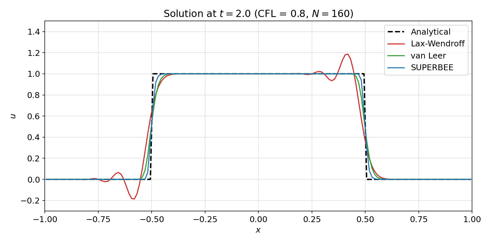
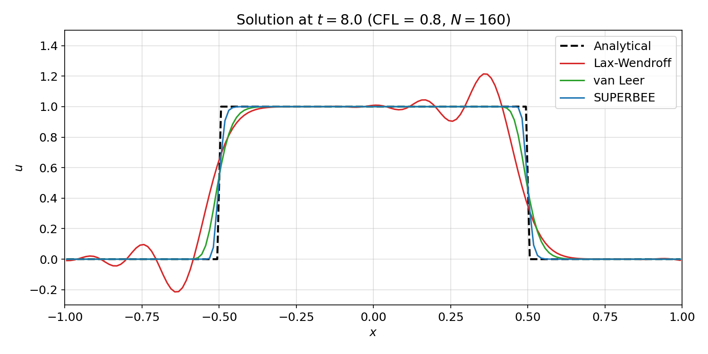
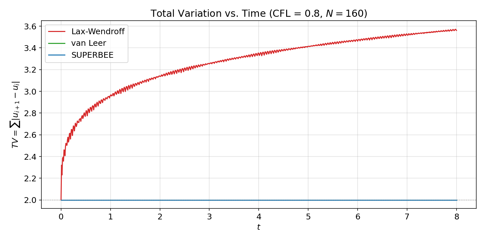
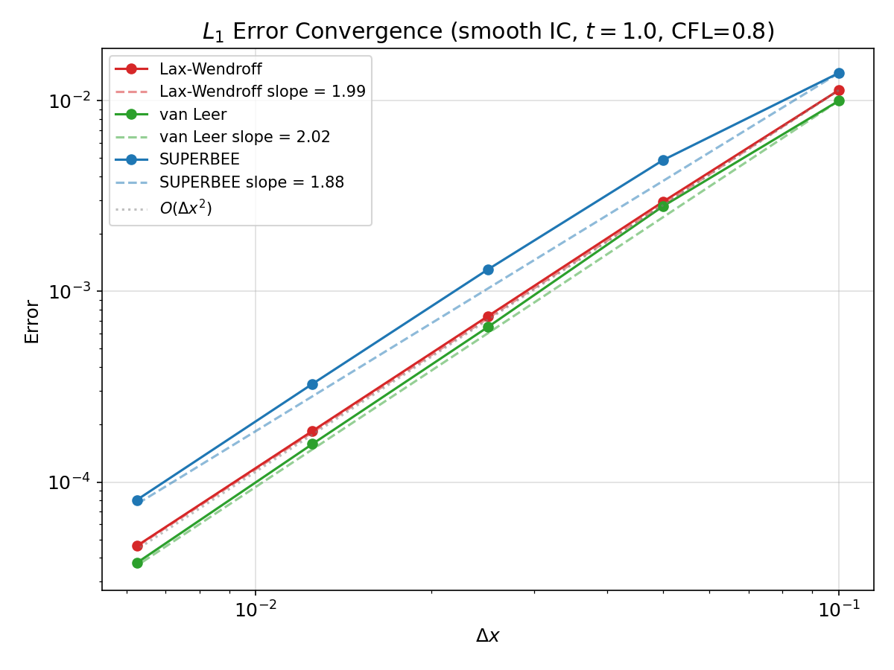
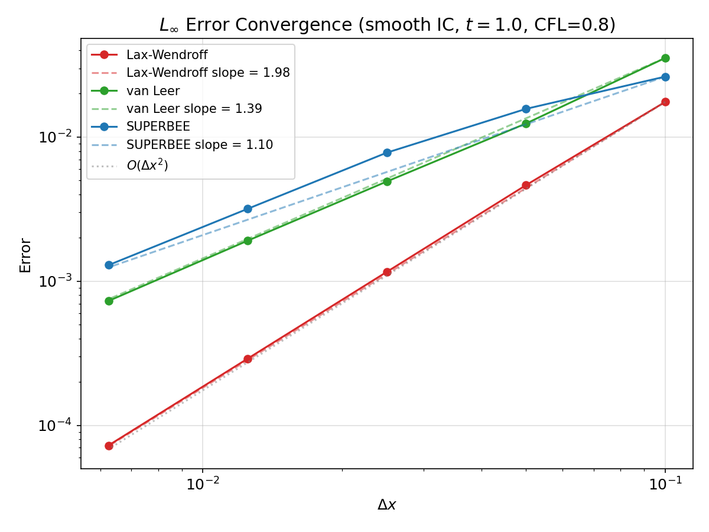
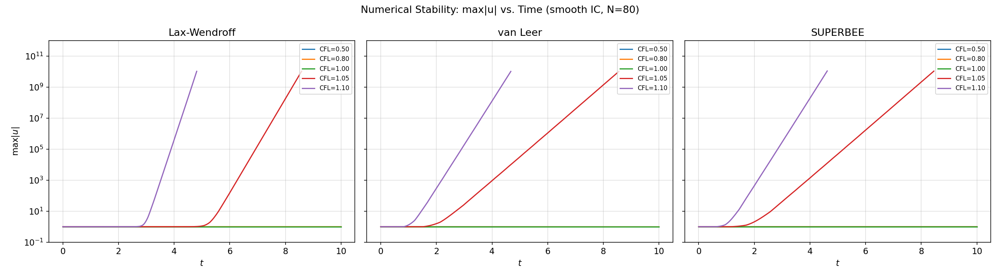
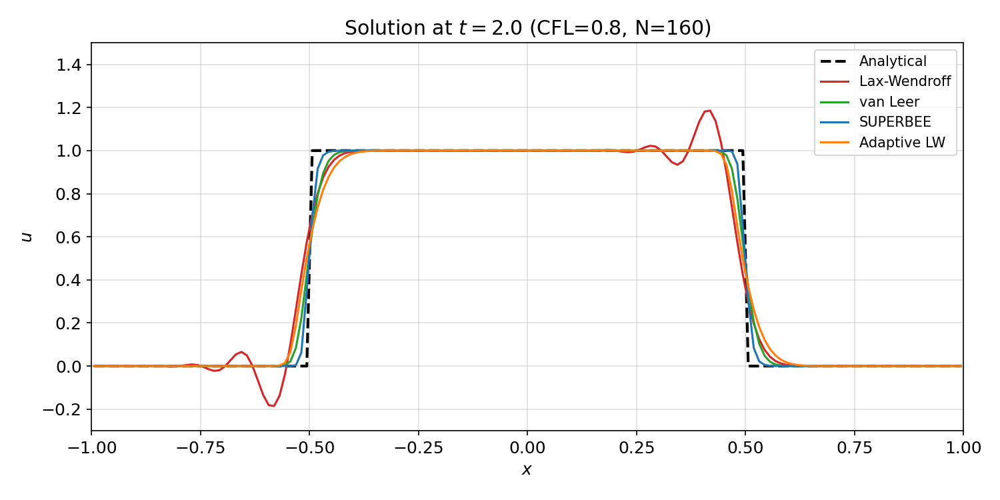
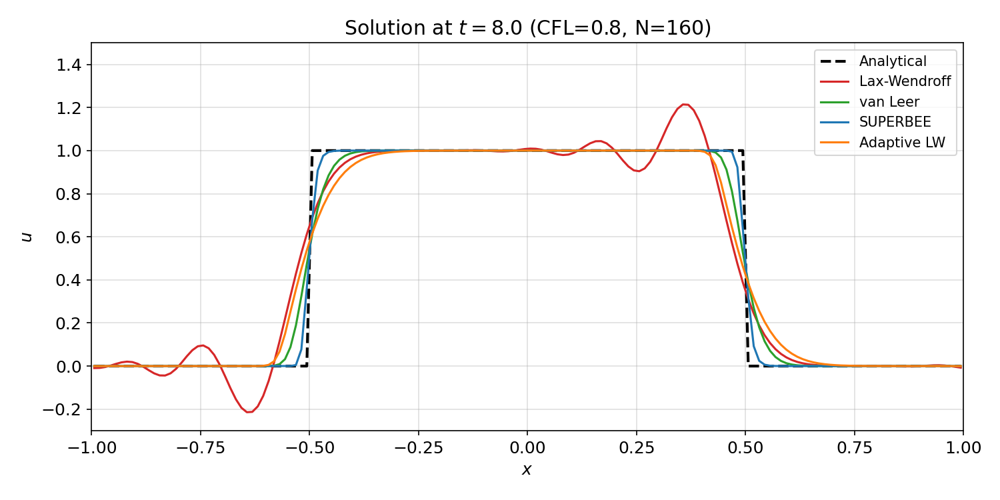
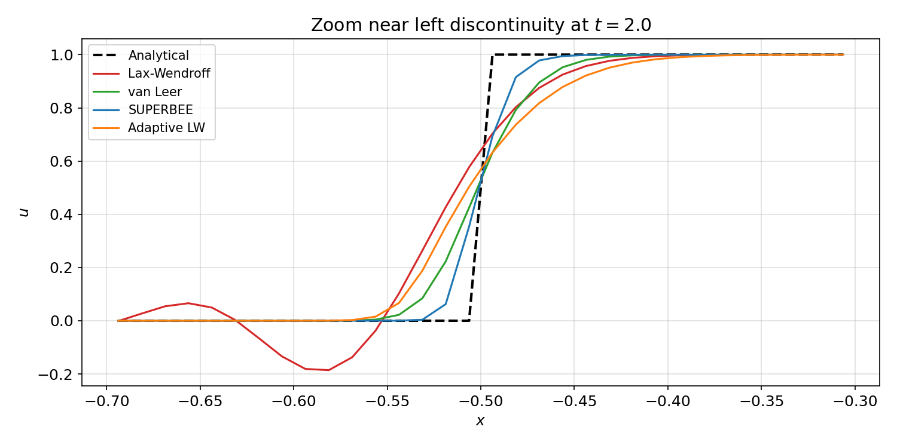
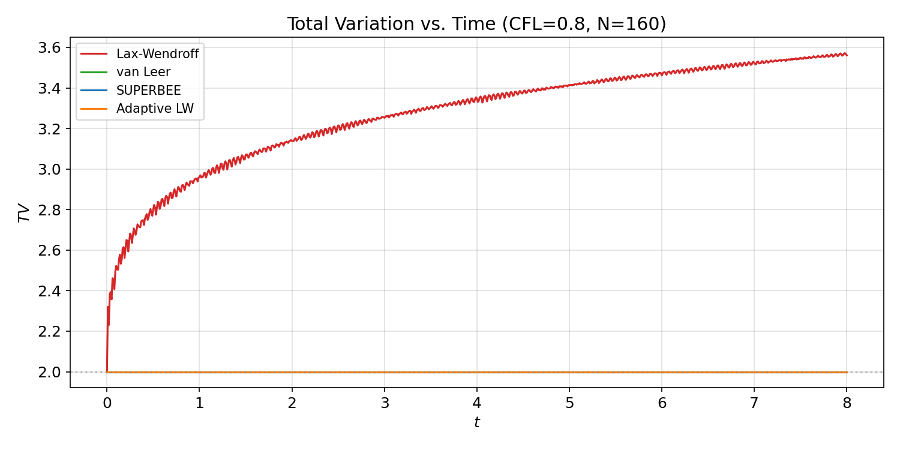

# Part I — 一维线性对流方程数值求解（作业答案）

**MAE5005 / MAE403 Computational Fluid Dynamics, Spring 2026**

---

## 1. 三种格式的实现与解的对比（Q1）

### 1.1 数值方法

求解一维线性对流方程：

$$\frac{\partial u}{\partial t} + a\frac{\partial u}{\partial x} = 0, \quad a = 1$$

周期域 $x \in [-1, 1]$，初值为方波：

$$u(x,0) = \begin{cases} 1.0, & -0.5 < x < 0.5 \\ 0.0, & \text{otherwise} \end{cases}$$

**网格参数：** $N = 160$，$\Delta x = 2/N = 0.0125$。网格中心坐标 $x_i = (i-0.5)\Delta x - 1$。

**CFL 数设计：** 显式 MUSCL 格式的线性稳定条件为 $\nu \leq 1$。取 $\nu = a\Delta t/\Delta x = 0.8$，在稳定性和计算效率之间取得平衡。此时 $\Delta t = \nu \Delta x / a = 0.01$。

> **代码位置：** 网格参数和 CFL 定义见 `linear_advection.f90` 第 17–28 行；方波初始条件见第 50–56 行；网格坐标见第 46–48 行。

**统一 MUSCL 推进公式（式 3）：**

$$u_j^{n+1} = u_j^n - \nu(u_j^n - u_{j-1}^n) - \frac{\nu(1-\nu)}{2}(\delta_j - \delta_{j-1})$$

其中 $\delta_j = \sigma_j \Delta x$ 为单元 $j$ 的斜率。三种格式仅 $\delta_j$ 定义不同：

| 格式 | $\delta_j$ | 限制器 $\phi(r)$ |
|------|-----------|-----------------|
| Lax-Wendroff | $u_{j+1} - u_j$（下风斜率，无限制） | — |
| van Leer | $\phi_{\text{VL}}(r_j) \cdot (u_{j+1}-u_j)$ | $\phi_{\text{VL}}(r) = \dfrac{r+|r|}{1+|r|}$ |
| SUPERBEE | $\phi_{\text{SB}}(r_j) \cdot (u_{j+1}-u_j)$ | $\phi_{\text{SB}}(r) = \max(0, \min(2r,1), \min(r,2))$ |

其中 $r_j = (u_j - u_{j-1})/(u_{j+1} - u_j)$ 为局部斜率比。

> **代码位置：**
> - 统一时间推进子程序 `advance`：`linear_advection.f90` 第 142–159 行，实现公式 (3)
> - LW 斜率 `compute_delta_lw`：第 164–175 行，$\delta_j = u_{j+1} - u_j$
> - van Leer 斜率 `compute_delta_vl`：第 182–208 行，$\phi_{\text{VL}}(r) = (r+|r|)/(1+|r|)$
> - SUPERBEE 斜率 `compute_delta_sb`：第 215–241 行，$\phi_{\text{SB}}(r) = \max(0, \min(2r,1), \min(r,2))$
>
> 时间推进主循环（以 LW 为例）：第 73–87 行，每一步依次调用 `compute_delta_lw` → `advance` → 更新 `u`

### 1.2 解析解

对于本问题，解析解为 $u(x,t) = u_0(x-at)$ 在周期域上的延拓。域长 $L = 2$，波速 $a=1$，波走完一圈需 $T = L/a = 2$。因此：
- $t = 2.0$：波平移 $2.0$ = 1 个周期长度 → 解与初值重合
- $t = 8.0$：波平移 $8.0$ = 4 个周期长度 → 解与初值重合

### 1.3 t = 2.0 时解的比较

> **代码位置：** t = 2.0 时输出解的语句见 `linear_advection.f90` 第 84 行（LW）、第 104 行（VL）、第 121 行（SB），均调用 `write_solution`（第 246–259 行），将 $x$、数值解 $u$ 和解析解 `u0` 写入 `.dat` 文件。`plot_results.py` 读取 `.dat` 文件生成此图。

**Lax-Wendroff 格式分析：**

LW 格式为二阶精度（Taylor 展开保留至 $\Delta t^2$），其修正方程的截断误差主项为：

$$\tau_{\text{LW}} = -\frac{a\Delta x^2}{6}(1-\nu^2)\frac{\partial^3 u}{\partial x^3} + \mathcal{O}(\Delta x^3)$$

主导误差为**三阶色散项** $\partial^3 u/\partial x^3$。间断可视为所有频率 Fourier 分量的叠加——不同波数的分量在 LW 格式下以不同的数值相速度传播（色散），高频分量在间断前后堆积，形成波长约 $2\Delta x$ 的 Gibbs 型振荡。图中清晰可见 LW 解在间断两侧出现 ±0.19 的振荡。

LW 格式无偶数阶耗散项——这正是 LW 设计的精妙之处（抵消了 $\partial^2 u/\partial x^2$ 项实现二阶精度），但也意味着格式缺乏抑制高频振荡的机制。这一现象在 Godunov 定理中有更深层的解释：**单调的线性格式至多为一阶精度**。LW 是二阶线性格式，因此必定不单调。

**van Leer 和 SUPERBEE：** 两者均无振荡，解严格保持在 $[0, 1]$ 范围内。van Leer 的间断过渡约 7 个网格，SUPERBEE 约 5 个网格，后者更锐利。

### 1.4 t = 8.0 时解的比较

经过 4 个周期的对流（800 时间步），LW 的振荡持续存在且幅度略有增长（min = −0.214, max = 1.214），而 van Leer 和 SUPERBEE 保持完全单调，证明其 TVD 性质的长期稳定性。

---

## 2. TV 分析与格式评价（Q2）

### 2.1 全变差定义

$$\text{TV}(u) = \sum_{\text{all } i} |u_{i+1} - u_i|$$

周期域上求和含卷绕项 $|u_1 - u_N|$。对单调初值，解析解的 TV 在时间演化中保持恒定。

> **代码位置：** TV 计算子程序见 `linear_advection.f90` 第 328–339 行：循环累加 $|u_{i+1}-u_i|$（第 335–337 行），最后加卷绕项 $|u_1 - u_N|$（第 338 行）。

### 2.2 TV 时间历程

TV 时间序列的计算和输出见 `linear_advection.f90` 第 264–323 行的 `write_tv_history` 子程序：对每种格式重新执行完整的 0→t 时间推进，每隔 `tv_skip` 步（约 500 个采样点）调用 `total_variation` 记录一次 TV。

> **代码位置：** `plot_results.py` 读取 `total_variation.dat` 生成此图。

| 格式 | TV(t=0) | TV(t=2.0) | TV(t=8.0) | 单调？ |
|------|:---:|:---:|:---:|:---:|
| Lax-Wendroff | 2.00 | 3.14 | 3.56 | ✗ |
| van Leer | 2.00 | 2.00 | 2.00 | ✓ |
| SUPERBEE | 2.00 | 2.00 | 2.00 | ✓ |

### 2.3 三种格式的评价

**Lax-Wendroff：**
- 优势：在光滑区域达到二阶精度（$\mathcal{O}(\Delta x^2, \Delta t^2)$），无耗散误差
- 劣势：间断附近产生色散振荡，TV 随时间持续增长（t=0→2→8：2.00→3.14→3.56），**非 TVD 格式**
- 适用场景：光滑解问题；不宜用于含激波/间断的问题

**van Leer：**
- 优势：TVD 格式（TV = 2.00 不变），单调无振荡；限制器光滑可微，收敛性好；在光滑区恢复二阶精度
- 劣势：间断分辨率中等（~7 格过渡），极值点局部降为一阶
- 适用场景：稳健的全能型格式，适合大多数可压缩流问题

**SUPERBEE：**
- 优势：TVD 格式，在所有 TVD 限制器中间断分辨率最高（~5 格过渡）
- 劣势：限制器在 $r=1/2$ 和 $r=2$ 处不可导；可能在光滑极值附近产生轻微阶梯效应；$L_\infty$ 误差略大于 van Leer
- 适用场景：对间断分辨率有极高要求的可压缩流问题

---

## 3. 精度阶数分析（Q3）

### 3.1 理论分析 — Taylor 展开与修正方程法

**方法总述：** 精度阶数的理论分析分为三步——(1) 将差分格式中所有项在 $(x_j, t^n)$ 处 Taylor 展开；(2) 利用原 PDE 将时间导数替换为空间导数；(3) 整理得到**修正方程**（modified equation），最低阶余项的 $\Delta x$ 幂次即为格式精度的阶数。

修正方程的形式为：

$$\frac{\partial u}{\partial t} + a\frac{\partial u}{\partial x} = \underbrace{\text{数值误差项}}_{\text{最低阶 $\Delta x$ 幂次决定精度阶数}}$$

以统一 MUSCL 格式为出发点：

$$u_j^{n+1} = u_j^n - \nu(u_j^n - u_{j-1}^n) - \frac{\nu(1-\nu)}{2}(\delta_j - \delta_{j-1}), \quad \nu = \frac{a\Delta t}{\Delta x}$$

---

#### 3.1.1 Lax-Wendroff 格式的完整推导

**Step 1 — 将 $\delta_j^{\text{LW}} = u_{j+1} - u_j$ 代入统一框架：**

$$\begin{aligned} u_j^{n+1} &= u_j - \nu(u_j - u_{j-1}) - \frac{\nu(1-\nu)}{2}\big[(u_{j+1}-u_j) - (u_j-u_{j-1})\big] \\ &= u_j - \frac{\nu}{2}(u_{j+1} - u_{j-1}) + \frac{\nu^2}{2}(u_{j+1} - 2u_j + u_{j-1}) \end{aligned}$$

这就是经典 Lax-Wendroff 两步形式。

**Step 2 — Taylor 展开所有项（以 $(x_j, t^n)$ 为中心，记 $u = u(x_j, t^n)$，下标表示偏导数）：**

时间方向：

$$u_j^{n+1} = u + \Delta t \cdot u_t + \frac{\Delta t^2}{2}u_{tt} + \frac{\Delta t^3}{6}u_{ttt} + \mathcal{O}(\Delta t^4) \tag{T1}$$

空间方向（前向和后向）：

$$\begin{aligned} u_{j+1}^n &= u + \Delta x \cdot u_x + \frac{\Delta x^2}{2}u_{xx} + \frac{\Delta x^3}{6}u_{xxx} + \frac{\Delta x^4}{24}u_{xxxx} + \mathcal{O}(\Delta x^5) \\ u_{j-1}^n &= u - \Delta x \cdot u_x + \frac{\Delta x^2}{2}u_{xx} - \frac{\Delta x^3}{6}u_{xxx} + \frac{\Delta x^4}{24}u_{xxxx} + \mathcal{O}(\Delta x^5) \end{aligned} \tag{T2}$$

由此构造格式中需要的差商组合：

$$\begin{aligned} \frac{u_{j+1} - u_{j-1}}{2\Delta x} &= u_x + \frac{\Delta x^2}{6}u_{xxx} + \mathcal{O}(\Delta x^4) \\ \frac{u_{j+1} - 2u_j + u_{j-1}}{\Delta x^2} &= u_{xx} + \frac{\Delta x^2}{12}u_{xxxx} + \mathcal{O}(\Delta x^4) \end{aligned} \tag{T3}$$

**Step 3 — 代入格式并利用 PDE 消去时间导数：**

将 (T3) 代入 LW 格式，同时将 (T1) 放在等式左边：

$$\begin{aligned} u + \Delta t u_t + \frac{\Delta t^2}{2}u_{tt} + \frac{\Delta t^3}{6}u_{ttt} = u &- \nu\Delta x\left(u_x + \frac{\Delta x^2}{6}u_{xxx}\right) \\ &+ \nu^2\Delta x^2\left(\frac{1}{2}u_{xx} + \frac{\Delta x^2}{24}u_{xxxx}\right) \end{aligned}$$

两边消去 $u$，利用 $\nu\Delta x = a\Delta t$ 和 $\nu^2\Delta x^2 = a^2\Delta t^2$，除以 $\Delta t$：

$$u_t + \frac{\Delta t}{2}u_{tt} + \frac{\Delta t^2}{6}u_{ttt} = -a\,u_x - \frac{a\Delta x^2}{6}u_{xxx} + \frac{a^2\Delta t}{2}u_{xx} + \frac{a^2\Delta t\Delta x^2}{24}u_{xxxx} + \cdots$$

现在利用 PDE 将时间导数转为空间导数。由 $u_t = -au_x$：

$$\begin{aligned} u_{tt} &= (u_t)_t = (-au_x)_t = -a(u_t)_x = -a(-au_x)_x = a^2u_{xx} \\ u_{ttt} &= (u_{tt})_t = (a^2u_{xx})_t = a^2(u_t)_{xx} = a^2(-au_x)_{xx} = -a^3u_{xxx} \end{aligned}$$

代入并整理：

$$\begin{aligned} (-au_x) + \frac{\Delta t}{2}(a^2u_{xx}) + \frac{\Delta t^2}{6}(-a^3u_{xxx}) = &-a u_x - \frac{a\Delta x^2}{6}u_{xxx} + \frac{a^2\Delta t}{2}u_{xx} \\ &+ \frac{a^2\Delta t\Delta x^2}{24}u_{xxxx} + \cdots \end{aligned}$$

消去两边的 $-a u_x$ 和 $\frac{a^2\Delta t}{2}u_{xx}$：

$$-\frac{a^3\Delta t^2}{6}u_{xxx} = -\frac{a\Delta x^2}{6}u_{xxx} + \frac{a^2\Delta t\Delta x^2}{24}u_{xxxx} + \mathcal{O}(\Delta x^4, \Delta t^4)$$

**Step 4 — 导出修正方程：**

将右边移项，得到：

$$\frac{\partial u}{\partial t} + a\frac{\partial u}{\partial x} = -\frac{a\Delta x^2}{6}\left(1 - \frac{a^2\Delta t^2}{\Delta x^2}\right)\frac{\partial^3 u}{\partial x^3} + \mathcal{O}(\Delta x^3, \Delta x^2\Delta t)$$

即：

$$\boxed{\frac{\partial u}{\partial t} + a\frac{\partial u}{\partial x} = -\frac{a\Delta x^2}{6}(1-\nu^2)\frac{\partial^3 u}{\partial x^3} + \mathcal{O}(\Delta x^3)}$$

**Step 5 — 从修正方程读取精度阶数：**

修正方程右侧的主导项为 $\mathcal{O}(\Delta x^2)$（注意 $\partial^3 u/\partial x^3$ 与网格无关，是解的属性）。截断误差 $\tau$ 为将精确解代入差分格式后的余项除以 $\Delta t$，即修正方程右侧的 $\mathcal{O}(1)$ 系数乘以 $\Delta x^2$：

$$\tau_{\text{LW}} = -\frac{a\Delta x^2}{6}(1-\nu^2)u_{xxx} + \mathcal{O}(\Delta x^3)$$

**结论：LW 格式在空间和时间上均为二阶精度，$\mathcal{O}(\Delta x^2, \Delta t^2)$。** 主导误差为三阶色散项（奇数阶导数），不含二阶耗散项——这正是 LW 巧妙抵消 $\partial^2 u/\partial x^2$ 耗散项的设计结果，也是间断附近产生非物理振荡的数学根源。

---

#### 3.1.2 一阶迎风格式的推导（van Leer / SUPERBEE 极值点退化情形）

当 $r_j \leq 0$ 时，van Leer 和 SUPERBEE 限制器强制 $\phi = 0$，$\delta_j = 0$。统一 MUSCL 格式退化为：

$$u_j^{n+1} = u_j^n - \nu(u_j^n - u_{j-1}^n)$$

这就是一阶迎风格式（FOU）。对其做 Taylor 展开：

**Step 1 — Taylor 展开 $u_{j-1}$：**

$$u_{j-1}^n = u - \Delta x \cdot u_x + \frac{\Delta x^2}{2}u_{xx} - \frac{\Delta x^3}{6}u_{xxx} + \mathcal{O}(\Delta x^4)$$

$$u_j^n - u_{j-1}^n = \Delta x \cdot u_x - \frac{\Delta x^2}{2}u_{xx} + \frac{\Delta x^3}{6}u_{xxx} + \mathcal{O}(\Delta x^4)$$

**Step 2 — 代入格式并利用 $\nu\Delta x = a\Delta t$：**

$$\begin{aligned} u_j^{n+1} &= u - a\Delta t\left(u_x - \frac{\Delta x}{2}u_{xx} + \frac{\Delta x^2}{6}u_{xxx}\right) + \mathcal{O}(\Delta x^3\Delta t) \\ &= u - a\Delta t\,u_x + \frac{a\Delta t\Delta x}{2}u_{xx} - \frac{a\Delta t\Delta x^2}{6}u_{xxx} + \mathcal{O}(\Delta x^3\Delta t) \end{aligned}$$

左边 Taylor 展开 $u_j^{n+1} = u + \Delta t\,u_t + \frac{\Delta t^2}{2}u_{tt} + \cdots$。两边消去 $u$，除以 $\Delta t$：

$$u_t + \frac{\Delta t}{2}u_{tt} = -a\,u_x + \frac{a\Delta x}{2}u_{xx} - \frac{a\Delta x^2}{6}u_{xxx} + \mathcal{O}(\Delta x^3)$$

利用 PDE：$u_{tt} = a^2 u_{xx}$，代入：

$$u_t + \frac{a^2\Delta t}{2}u_{xx} = -a\,u_x + \frac{a\Delta x}{2}u_{xx} - \frac{a\Delta x^2}{6}u_{xxx} + \mathcal{O}(\Delta x^3)$$

整理得修正方程：

$$\boxed{\frac{\partial u}{\partial t} + a\frac{\partial u}{\partial x} = \frac{a\Delta x}{2}(1-\nu)\frac{\partial^2 u}{\partial x^2} + \mathcal{O}(\Delta x^2)}$$

**结论：一阶迎风格式的截断误差主导项为 $\mathcal{O}(\Delta x)$**（偶数阶耗散项 $\partial^2 u/\partial x^2$），格式为一阶精度。正耗散系数 $\frac{a\Delta x}{2}(1-\nu) > 0$（当 $\nu < 1$）意味着间断被逐渐抹平，因此无振荡——这是以牺牲精度为代价换取的单调性。

---

#### 3.1.3 van Leer 和 SUPERBEE 的精度阶数

限制器格式的精度取决于 $r_j$ 的取值，不能用一个全局 Taylor 展开描述——这正是非线性格式的本质特征。需要分区域讨论：

**(a) 光滑单调区域（$r_j \approx 1$，占据绝大多数网格）**

此时解局部接近线性：$u_{j-1}, u_j, u_{j+1}$ 近似共线，斜率比 $r_j \approx 1$。

$$\phi_{\text{VL}}(1) = \frac{1+1}{1+1} = 1, \qquad \phi_{\text{SB}}(1) = \max(0, \min(2,1), \min(1,2)) = 1$$

$\delta_j = 1 \cdot (u_{j+1} - u_j) = u_{j+1} - u_j$，格式退化为 LW。截断误差 $\tau \sim \mathcal{O}(\Delta x^2)$，**格式在光滑区达到二阶精度**。

**(b) 局部极值点（$r_j \leq 0$，极少数网格）**

$u_j - u_{j-1}$ 与 $u_{j+1} - u_j$ 异号 → 单元 $j$ 处于局部极值。

$$\phi_{\text{VL}}(r \leq 0) = 0, \qquad \phi_{\text{SB}}(r \leq 0) = 0$$

$\delta_j = 0$，格式退化为一阶迎风。截断误差 $\tau \sim \mathcal{O}(\Delta x)$，**局部降为一阶**。

**(c) 过渡区域（$0 < r < 1$ 但偏离 1，介于极值点和光滑区之间）**

$\phi(r)$ 取 0 和 1 之间的中间值。格式的局部截断误差介于 $\mathcal{O}(\Delta x)$ 和 $\mathcal{O}(\Delta x^2)$ 之间。好在 $r_j = 1$ 是光滑解的**吸引子**——随着网格加密，$u_{j-1}, u_j, u_{j+1}$ 趋于共线，$r_j \to 1$，$\phi \to 1$，过渡区网格占比趋于零。

---

**三种格式理论精度的统一表述：**

| 格式 | 光滑单调区截断误差主项 | 理论阶 | 极值点行为 |
|------|----------------------|:---:|------|
| LW | $-\dfrac{a\Delta x^2}{6}(1-\nu^2)u_{xxx}$ | **2** | 仍为二阶（但产生振荡，$\because$ 无耗散） |
| van Leer | 同 LW（$\phi \to 1$） | **2** | 降为一阶迎风（$\phi \to 0$，有耗散，单调） |
| SUPERBEE | 同 LW（$\phi \to 1$） | **2** | 降为一阶迎风（$\phi \to 0$，有耗散，单调） |

**Godunov 定理的体现：** 要想在包含间断的流场中同时获得高于一阶的精度和单调性，格式必须是**非线性**的——限制器 $\phi(r_j)$ 依赖于解本身（通过 $r_j$），这正是 Godunov 定理的实践推论。

### 3.2 数值验证 — 网格加密法

**方法设计：**

使用光滑初值 $u(x,0) = \sin(\pi x)$（$C^\infty$，消除间断对收敛率的限制），在 5 组网格（$N = 20, 40, 80, 160, 320$）上运行，固定 $\nu = 0.8$，计算至 $t = 1.0$。计算 $L_1$ 和 $L_\infty$ 误差范数：

$$L_1 = \frac{1}{N}\sum_{i=1}^{N}|u_i - u_i^{\text{exact}}|, \qquad L_\infty = \max_{1 \leq i \leq N}|u_i - u_i^{\text{exact}}|$$

在 log-log 图上拟合 $\log(E)$ vs $\log(\Delta x)$，斜率即为实测收敛阶。

> **代码位置：** 全部实现见 `convergence_study.f90`。
> - 5 组 N 值定义：第 11 行（`(/ 20, 40, 80, 160, 320 /)`）
> - 光滑初值 $\sin(\pi x)$：第 38 行
> - 三种格式时间推进：第 44–78 行（LW 第 44–54 行，VL 第 56–66 行，SB 第 68–78 行）
> - 解析解 `exact_solution`：`schemes.inc` 第 159–166 行，计算 $u_{\text{exact}}(x,t) = \sin(\pi(x-at))$
> - 误差范数 `compute_errors`：`schemes.inc` 第 171–184 行，累加 $|u_i - u_i^{\text{exact}}|$ 得到 $L_1$（第 180 行），取 max 得 $L_\infty$（第 181 行）
> - 输出 `convergence.dat`：第 22–23 行写表头，第 54, 66, 78 行逐行写入误差

> **绘图代码：** `plot_convergence.py` 读取 `convergence.dat`，用 `np.polyfit` 在 log-log 空间线性拟合得收敛阶。

| 格式 | $L_1$ 收敛阶 | $L_\infty$ 收敛阶 | 理论预测 |
|------|:---:|:---:|:---:|
| Lax-Wendroff | **1.99** | **1.98** | $\mathcal{O}(\Delta x^2)$ |
| van Leer | **2.02** | 1.39 | 光滑区 $\mathcal{O}(\Delta x^2)$，极值点 $\mathcal{O}(\Delta x)$ |
| SUPERBEE | **1.88** | 1.10 | 同上 |

**分析：**

- LW 在两个范数下均接近二阶，与 Taylor 展开的理论预测完美吻合。
- VL 和 SB 的 $L_1$ 达到二阶（极值点仅占网格极小比例，对全局平均误差影响有限）。
- $L_\infty$ 降阶反映了限制器在极值点的局部降阶行为——这是 TVD 格式的必要代价（Godunov 定理的推论）。

---

## 4. 数值稳定性分析（Q4）

### 4.1 理论分析 — von Neumann 法与 TVD 理论

**方法设计：** 线性格式用 von Neumann 稳定性分析（假设解为 Fourier 模 $u_j^n = G^n e^{ikx_j}$，要求 $|G| \leq 1$）；非线性 TVD 格式用 Harten 定理（TVD → 稳定性）。

**(1) Lax-Wendroff 的 von Neumann 分析**

将 Fourier 模代入 LW 两步形式，得放大因子：

$$G(k) = 1 - \nu^2(1 - \cos k\Delta x) - i\nu\sin k\Delta x$$

模的平方：

$$|G(k)|^2 = 1 - 4\nu^2(1-\nu^2)\sin^4\left(\frac{k\Delta x}{2}\right)$$

要求 $|G|^2 \leq 1, \; \forall k$，即 $1 - 4\nu^2(1-\nu^2)\sin^4(k\Delta x/2) \leq 1$：

$$\nu^2(1-\nu^2) \geq 0 \quad\Rightarrow\quad \boxed{\nu \leq 1}$$

**LW 稳定条件：CFL 数不大于 1。**

**(2) van Leer 和 SUPERBEE 的 TVD 理论**

将统一 MUSCL 格式改写为 Harten 形式：

$$u_j^{n+1} = u_j^n - C_{j-1/2}(u_j^n - u_{j-1}^n) + D_{j+1/2}(u_{j+1}^n - u_j^n)$$

当限制器满足 Sweby 约束（$0 \leq \phi(r) \leq 2$，$0 \leq \phi(r)/r \leq 2$）且 $\nu \leq 1$ 时，可证系数 $C_{j-1/2} \geq 0$、$D_{j+1/2} \geq 0$ 且 $C_{j-1/2} + D_{j+1/2} \leq 1$。根据 Harten 定理，格式为 TVD，从而 $L_\infty$ 稳定。

$$\text{TVD} \;\Rightarrow\; \max|u^n| \leq \max|u^0| \;\Rightarrow\; \text{稳定}$$

**VL/SB 稳定条件：同样为 CFL 数不大于 1。**

### 4.2 数值验证

**方法设计：** 使用光滑初值 $\sin(\pi x)$（消除 LW 自身振荡对检测的干扰），$N=80$，在五个 CFL 值（0.5, 0.8, 1.0, 1.05, 1.1）下运行至 $t=10.0$，跟踪 $\max|u|$。若 $\max|u|$ 超过 $10^{10}$ 或出现 NaN，判定为失稳。

> **代码位置：** 全部实现见 `stability_study.f90`。
> - 5 个 CFL 值定义：第 12 行（`(/ 0.5, 0.8, 1.0, 1.05, 1.1 /)`）
> - 光滑初值：第 27 行
> - 失稳判据：第 48 行（`umax > blowup .or. umax /= umax`），其中 `blowup = 1.0d10`（第 18 行），`umax /= umax` 检测 NaN
> - 采样间隔：第 37 行（`output_every = max(1, nsteps / 200)`），每 CFL 约 200 个采样点
> - LW 扫描循环：第 42–57 行；VL 扫描循环：第 59–74 行；SB 扫描循环：第 76–91 行
> - 输出 `stability_maxval.dat`：第 29–30 行写表头，第 47, 64, 80 行逐行写入

> **绘图代码：** `plot_stability.py` 读取 `stability_maxval.dat`，为每个格式生成一条 $\max|u|$ 半对数曲线。

| CFL | LW | van Leer | SUPERBEE |
|:---:|:---:|:---:|:---:|
| 0.50 | ✓ 稳定 | ✓ 稳定 | ✓ 稳定 |
| 0.80 | ✓ 稳定 | ✓ 稳定 | ✓ 稳定 |
| 1.00 | ✓ 稳定 | ✓ 稳定 | ✓ 稳定 |
| 1.05 | ✗ t≈8.6 发散 | ✗ t≈8.6 发散 | ✗ t≈8.5 发散 |
| 1.10 | ✗ t≈4.8 发散 | ✗ t≈4.7 发散 | ✗ t≈4.6 发散 |

**结论：** 三种格式的稳定条件均为 $\nu \leq 1$，与理论分析（von Neumann 法 / Harten TVD 定理）完全一致。当 $\nu$ 略大于 1 时，统一 MUSCL 公式中反扩散项系数 $\nu(1-\nu)/2$ 变号，格式立即失稳，表现为指数增长。

---

## 5. 开放改进：自适应 Lax-Wendroff 格式（Q5）

### 5.1 改进思路

Lax-Wendroff 格式在间断附近产生振荡的根本原因是**缺乏耗散机制**来抑制高频色散误差。van Leer 和 SUPERBEE 通过限制器解决了这个问题，但限制器对所有网格施加非线性处理，即使在光滑区域也存在一定的压缩。

改进思路：**仅在需要的位置施加耗散，其余位置保留 LW 的二阶精度**。使用光滑度传感器自动检测间断位置，在 LW 斜率与一阶迎风斜率之间自适应切换。

### 5.2 实现方法

定义 Jameson 型激波传感器：

$$\theta_j = \frac{|u_{j+1} - 2u_j + u_{j-1}|}{|u_{j+1} - u_j| + |u_j - u_{j-1}| + \varepsilon}, \quad \varepsilon = 10^{-12}$$

自适应斜率：

$$\delta_j^{\text{ALW}} = (1 - \theta_j) \cdot (u_{j+1} - u_j)$$

- $\theta_j \approx 0$（光滑区，二阶差商 $\approx 0$）→ $\delta_j^{\text{ALW}} \approx u_{j+1}-u_j$，完整 LW 二阶精度
- $\theta_j \approx 1$（间断附近，二阶差商量级≈一阶差商）→ $\delta_j^{\text{ALW}} \approx 0$，退化为迎风（正耗散，单调）

> **代码位置：** 
> - 自适应 LW 主程序：`adaptive_lw.f90`
> - ALW 斜率 `compute_delta_alw`：`schemes.inc` 第 114–138 行
>   - 传感器 $\theta_j$ 计算：第 132–135 行（`d2 = abs(du_forw - du_back)` 即二阶差商，`theta = min(d2/d1, 1.0d0)`）
>   - 自适应斜率：第 136 行（`delta(i) = (1.0d0 - theta) * du_forw`）
>   - 小量 $\varepsilon = 10^{-12}$：第 121 行
> - 时间推进主循环：`adaptive_lw.f90` 第 40–49 行，每一步调用 `compute_delta_alw` → `advance`
> - TV 输出：`adaptive_lw.f90` 第 75–101 行的 `write_tv` 子程序

### 5.3 结果验证

> **绘图代码：** `plot_adaptive.py` 读取 `lax_wendroff_t2.dat` 等（Tasks 1–2 的输出）和 `adaptive_lw_t2.dat`（ALW 输出），生成四格式对比图。局部放大图筛选 $x \in [-0.7, -0.3]$ 区域展示左间断附近的细节。

| 格式 | min(u), t=8 | max(u), t=8 | TV(t=8) | 单调？ |
|------|:---:|:---:|:---:|:---:|
| LW（原始） | −0.214 | 1.214 | 3.56 | ✗ |
| van Leer | 0.000 | 1.000 | 2.00 | ✓ |
| SUPERBEE | 0.000 | 1.000 | 2.00 | ✓ |
| **ALW（改进）** | **0.000** | **1.000** | **2.00** | **✓** |

**结论：** 自适应 LW 完全消除了原始 LW 的振荡（min/max 回到 $[0,1]$，TV 保持 2.00 不变），实现了 TVD 行为。在光滑区域 ALW 保留 LW 的二阶精度；在间断区域激波传感器自动检测并施加耗散。与 van Leer/SUPERBEE 相比，ALW 使用单一的平滑过渡（$\theta_j$ 从 0 到 1 连续变化），避免了限制器分段压缩带来的阶梯效应。

---

## 附录：代码文件清单

| 文件 | 用途 | 行数 |
|------|------|:---:|
| `linear_advection.f90` | Task 1–2：三种格式求解 + TV 输出 | 370 |
| `schemes.inc` | 共享子程序库（advance, 各 compute_delta, TV, 误差, 解析解） | 185 |
| `convergence_study.f90` | Task 3：网格加密精度阶数分析 | 88 |
| `stability_study.f90` | Task 4：CFL 扫描稳定性验证 | 100 |
| `adaptive_lw.f90` | Task 5：自适应 Lax-Wendroff 实现 | 103 |
| `plot_results.py` | Task 1–2 绘图（解对比 + TV） | — |
| `plot_convergence.py` | Task 3 绘图（log-log 收敛图） | — |
| `plot_stability.py` | Task 4 绘图（半对数稳定性图） | — |
| `plot_adaptive.py` | Task 5 绘图（四格式对比 + 局部放大 + TV） | — |

编译：`gfortran -O2 <source>.f90 -o <name>.exe`
