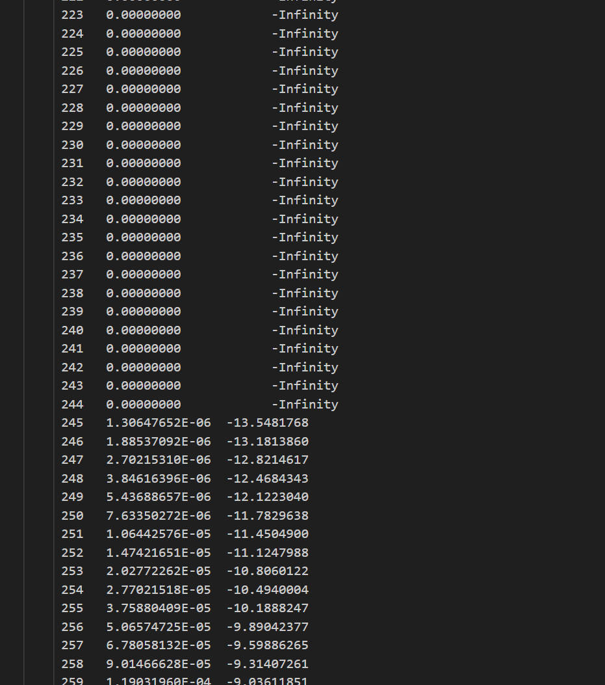
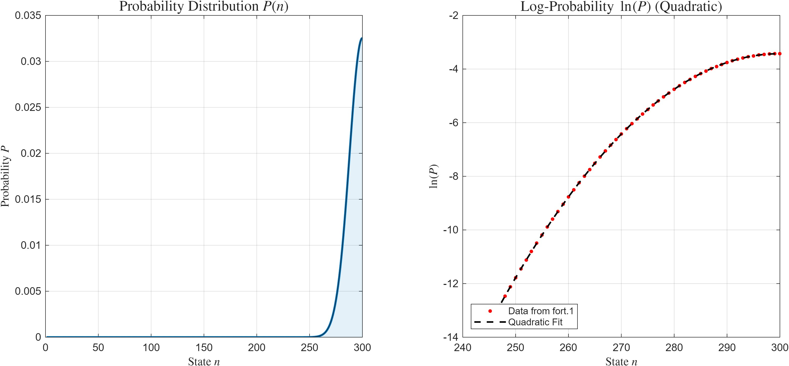
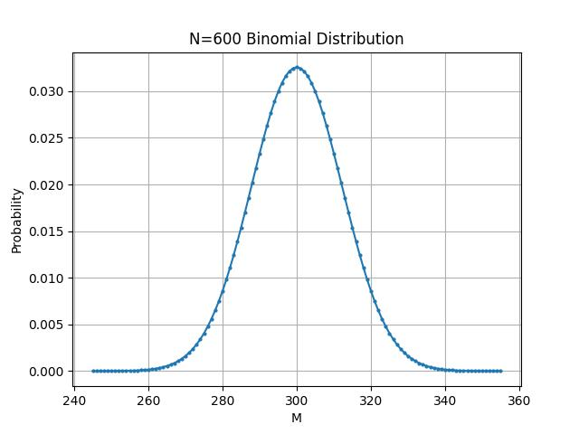
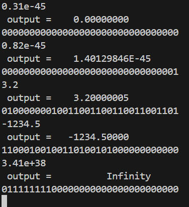

# CFD_HW_1

**姓名：梁祝旸**  
**学号：12532299**  
**课程：计算流体力学**  
**日期：2026-03-09**

---


## Question 1: Self-Introduction


###
My name is Liang Zhuyang, and I am currently a first-year graduate student. I completed my undergraduate studies in the Department of Mechanics and Aerospace Engineering at Southern University of Science and Technology. Under the supervision of Professor Liu Yu, I am conducting research in the PC Centrifugal Fan Noise Reduction group at A3Lab, where I focus on simulating and optimizing the internal flow structures of fans.

###
我叫梁祝旸，目前研一，本科就读于南方科技大学力学与航空航天工程系。我的研究生导师是刘宇教授。目前在A3Lab实验室PC离心风扇降噪小组参与科研工作，主要负责风扇内部流动结构的仿真和优化。

---


## Question 2: Bilinear Distribution Problem

###
（a）for N = 6, the answer should be：

$$
P(M) = C_6^M \cdot 2^{-6} = \frac{6!}{M!(6-M)!} \cdot \frac{1}{64}, \quad M=0,1,...,6
$$

遍历所有可能的 M：

| M | $C_6^M$ | P(M) |
|---|--------|------|
| 0 | 1      | 0.015625 |
| 1 | 6      | 0.09375  |
| 2 | 15     | 0.234375 |
| 3 | 20     | 0.3125   |
| 4 | 15     | 0.234375 |
| 5 | 6      | 0.09375  |
| 6 | 1      | 0.015625 |


###
（b）for N = 300, the Fortran program shows:
```Fortran
    Program main
    implicit none
    real*4 y
    integer i,m,n

    ! setting up the variables
    m = 600

    ! loop calculate
    do n=1,300
        y = - m * log(2.0)
        do i=1,n
            y = y + log(REAL(m - n + i)) - log(REAL(n + 1 - i))
        enddo
        if (y + 6 * log(10.0) < 0) then
            y = 0
        else
            y = exp(y)
        endif
        ! output all the data
        write(1,*) n,y,log(y)
    enddo

    end program main
```
(note: in this code, m and n are at the contrary place, m > n)


The output is a table "fort.1", here is a part of it:



I use matlab for the plot:

Because **n** is 0 to 300(**m**/2), the plot is **left half part** of a standard sysmetric bilinear distribution.


###
（c）The DeepSeek answer code for question(a)、(b):
```Fortran
    program binomial_probability
        implicit none
        integer, parameter :: N = 600
        integer :: M
        real(kind=8) :: P, P0
        character(len=20) :: filename

        filename = 'prob_N600.dat'
        open(unit=10, file=filename, status='replace')

        ! 计算 P(0) = 1 / 2^N
        P0 = 1.0d0 / (2.0d0 ** N)

        P = P0
        if (P >= 1.0d-6) then
            write(10, *) 0, P
        end if

        do M = 1, N
            P = P * (N - M + 1.0d0) / (M * 1.0d0)
            if (P >= 1.0d-6) then
                write(10, *) M, P
            end if
        end do

        close(10)
        print *, 'Output written to ', filename
    end program binomial_probability
```

DeepSeek use **python** to plot:



There are several differences between my answers and DeepSeek's answers:
1. I use ***ln*** methed to calculate the probability P in order to avoided numerical overflow and underflow. But DeepSeek simply uses division and computes the result through an iterative loop. That is why I can use *****real*** * 4** (single precision), while DeepSeek uses *****real*** * 8** (single precision)
2. The output method DeepSeek used is much smarter than mine.
3. The input method DeepSeek used is easy the debug.

---

## Question 3: Interprete Problem

###
(i) The answer compute by ***inputoutput.f90*** :



(ii) The precise binary form can be divided into **3** parts:
1. **sign bit(S) :**(1<sup>st</sup> bit)
Show the sign of the munber. **0** for positive(**+**), **1** for negative(**-**).
2. **Exponent bit(E) :**(2<sup>ed</sup>~9<sup>th</sup> bits)
Show the **exponent** with a upper limit of 2<sup>127</sup>
1. **Fraction bit(F) :**(10<sup>th</sup>~32<sup>ed</sup> bits).
Show the mantissa part of the munber.

The calculate method is:
$$
\text{Value} =
\begin{cases}
(-1)^S \times 1.F \times 2^{E-127}, & E \neq 0 \\
(-1)^S \times 0.F \times 2^{-126}, & E = 0
\end{cases}
$$

The explaination for each munbers:


(a) 0.31e-45 ==> 0|00000000|00000000000000000000000
$$
(-1)^0 \times 0.0 \times 2^{-126} = 0
$$

This number is too small that **underflow** to 0.


(b) 0.82e-45 ==> 0|00000000|00000000000000000000001
$$
(-1)^0 \times 2^{-23} \times 2^{-126} \approx 1.4013 \times 10^{-45}
$$

This is the **smallest** munber that single-precision float can be.


(c) 3.2 ==> 0|10000000|10011001100110011001101
$$
(-1)^0 \times (1 + 2^{-23}+2^{-21}+2^{-20}+2^{-17}+2^{-16}+2^{-13}+2^{-12}+2^{-9}+2^{-8}+2^{-5}+2^{-4}+2^{-1}) \times 2^{1} \approx 3.2
$$

Almost correct.


(d) -1234.5 ==> 1|10001001|00110100101000000000000
$$
(-1)^1 \times (1 + 2^{-11}+2^{-9}+2^{-6}+2^{-4}+2^{-3}) \times 2^{137-127} \approx -1234.5
$$

Almost correct.


(e) 3.41e+38 ==> 0|11111111|00000000000000000000000
$$E = 11111111$$ 

It means the number is **too big** that **overflow** to be **Infinity**.


###
DeepSeek's answers:
```Fortran
    program float_binary
        implicit none
        real :: x
        integer :: i
        integer, dimension(32) :: bits
        
        ! 读取输入
        print *, 'Enter a real number:'
        read *, x
        
        ! 将实数的内存表示转换为整数
        ! 使用 transfer 函数和等价语句
        block
            integer :: ix
            ix = transfer(x, 1)
            
            ! 提取每一位
            do i = 1, 32
                bits(i) = ibits(ix, 32-i, 1)
            end do
        end block
        
        ! 输出二进制表示
        print '(A)', 'Binary representation (32 bits):'
        write(*, '(32I1)') (bits(i), i=1,32)
        
        ! 按 IEEE 754 格式分组输出：符号位 | 指数位 | 尾数位
        print '(A)', 'Format: sign | exponent | mantissa'
        write(*, '(I1, A, 8I1, A, 23I1)') bits(1), ' | ', (bits(i), i=2,9), ' | ', (bits(i), i=10,32)
        
    end program float_binary
```
The total lines is more than 10, but the mainly function lines are less than 10.

The output for the 5 numbers by DeepSeek's answers:

(a) 0.31e-45
```
Input number: 0.310E-45
Binary representation (32 bits):
00000000000000000000000000000000
Format: sign | exponent | mantissa
0 | 00000000 | 00000000000000000000000
```
(b) 0.82e-45
```
Input number: 0.820E-45
Binary representation (32 bits):
00000000000000000000000000000001
Format: sign | exponent | mantissa
0 | 00000000 | 00000000000000000000001
```
(c) 3.2
```
Input number: 0.320E+01
Binary representation (32 bits):
01000000010011001100110011001101
Format: sign | exponent | mantissa
0 | 10000000 | 10011001100110011001101
```
(d) -1234.5
```
Input number: -0.12345E+04
Binary representation (32 bits):
11000100100110100101000000000000
Format: sign | exponent | mantissa
1 | 10001001 | 00110100101000000000000
```
(e) 3.41e+38
```
Input number: 0.341E+39
Binary representation (32 bits):
01111111011111111111111111111111
Format: sign | exponent | mantissa
0 | 11111110 | 11111111111111111111111
```
#### What do I learn in this exercise? 
1. DeepSeek gives the answers almost correct, especially the code, but it missread the 5<sup>th</sup> number, so the answer is wrong.
2. The number **can not** be **exactlly real** from the precise binary form to the real number.
3. The **overflow mod** is different from the **underflow mod**.(in number (a) and (e))


---


## Question 4: Ad. Interprete Problem

#### (a) According to the above conversion relations, what is the exact magnitude of the smallest non-zero normal value? And what is the corresponding binary representation?

The smallest number is : 0 | 00000001 | 00000000000000000000000
$$(-1)^0 \times 1.0 \times 2^{1-127} \approx 1.175495435 \times 10^{-38}$$

#### (b) What is the exact magnitude of the largest subnormal value? And what is the corresponding binary representation?
The largest subnormal number is : 0 | 00000000 | 11111111111111111111111
$$(-1)^0 \times (1 - 2^{-23}) \times 2^{-126} \approx 1.1754942 \times 10^{-38}$$

#### (c)  What is the theoretical round-off error when computing (π<sup>2</sup>/12) (known as thefirst Nielsen–Ramanujan constant)?

$$ \pi^{2}/12 \approx 0.822467 > 1.175495435 \times 10^{-38}$$

So, it has to be a **normal number**.
And, we knew:
$$ 1.F \times 2^{E-127} \approx 0.822467$$

So, we can calculte E:
$$ E \approx \log_2 0.822467 + 127 \approx 126 $$

The round-off error for a **normal number** is:
$$ 2^{-23} / 2 \times 2^{126 - 127} = 2^{-25} $$

#### (d)   What is the theoretical round-off error when computing $\sqrt{2}$ ?
$$ \sqrt{2} \approx 1.414213562 > 1.175495435 \times 10^{-38}$$

So, it has to be a **normal number**.

The corresponding binary representation is about : 0|01111111|01101010000010011110011

The round-off error for $\sqrt{2}$ is:
$$ 2^{-23} / 2 \times 2^{127 - 127} = 2^{-24} $$

#### (d)    From the above, what can you conclude regarding the number of significant digits(in decimal) that a single-precision representation can produce?
What ever the number(in decimal) is, the smallest unit in single-precision representation is : $2^{-24}$.
So, the number of significant digits(in decimal) is about :
$$ 24 \times \log_{10} 2 \approx 7.22 $$
A single-precision floating-point number can provide approximately **7** significant decimal digits of precision.


EOF