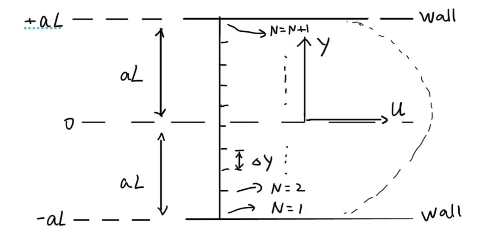

# CFD_HW_1

**姓名：梁祝旸**  
**学号：12532299**  
**课程：计算流体力学**  
**日期：2026-03-09**

---


## Question 1: Code-Explaination

#### (a) Using the lecture notes as a guide, explain what flow problem this code is trying to solve;

The code simulates the transient development of a 1-D viscous channel flow driven by a constant pressure gradient.
The governing equation is :
$$
\frac{\partial u}{\partial t}=\nu \frac{\partial^2 u}{\partial y^2}+g
$$

With a constant body force **g** :
$$
g = \frac{2\nu u_0}{a_L^2}
$$

And B.C.s :
$$
\begin{cases}
    u(-a_L,t) = 0 \\
    u(a_L,t) = 0
\end{cases}
$$

#### (b)   Provide a sketch of the flow domain and the locations of the grid points;

The plot is kind of like :


As a 1-D flow, the grid points are just saperated along **y**-axis. And the number of points is **N + 1**.
The sketch of flow shape is just a **sketch**, the **u** at walls have to be **0**.

#### (c)    Describe, in your own words, all the input parameters for this code and their meaning;

```
integer,parameter      :: N=8, Ntime=64
real*8,parameter       ::  dt = 0.032d0

real*8,parameter       :: u0=1.0d0, aL=1.0d0, anu=0.1
```
**N** means the number of grids. (number of grid ponits is **N + 1**)

**Ntime** is used for control the frequency for print out the theory solution for comparison every **Ntime** steps. 

**dt** is the **time step** for the explicit Euler integration. 

**u0** is the **maxximum velocity** in the steady case, whitch should be the steady velocity at **y = 0**.

**al** is the half width of the channel.

**anu** is the **kinematic viscosity $\nu$** of the fluid.

#### (d)    Describe, in your own words, what are the output data of the code?

there are two kinds of output in this code.

1. Output all the parameters:
```
write(*,*) 'anu, dt, aL, dy, CFL=', anu, dt, aL, dy, CFL
...
write(*,*) 'Tend, dt, Ntime, nsteps=', Tend, dt, Ntime, nsteps
```
Except those constant parameters described at question(C), the other parameters are definded as :

**dy** means the length of each unit grid.

**CFL** decides the stability parameter for explicit Euler integration. In the code is :
$$
CFL = \frac{\nu \Delta t}{\Delta y^2}
$$

In this 1-D flow, CFL should smaller than 0.5.

**Tend** is shown as : 
$$
Tend = \frac{3  (aL)^{2}}{\nu}
$$

It is 3 times the viscous diffusion time scale(in order to reach the steady state), and **Tend** decides how long the simulation is.(physical time)

And **nstep** is : 
$$
nstep = \frac{Tend}{dt}
$$

Eventually **nstep** is the loop time steps.(Iteration time)


2. Output the calculation results and compare with the real results:
```
         write(55,100)ycc,theory1,u(j)/u0,abs(u(j)-theory1)/theory1
         ...
         100     format(2x, 4f16.12)
```
This code asks computer to write the results in a file named "fort.55".

The 4 numbers are :

**ycc:** the coordinate of the data points.
**theory1:** the theoretical solution at **ycc** point.
**u(j)/u0:** the numerical solution at **ycc** point.(non-dim velocity)
**abs(u(j)-theory1)/theory1:** the error between the theoretical solution and numerical solution.


EOF