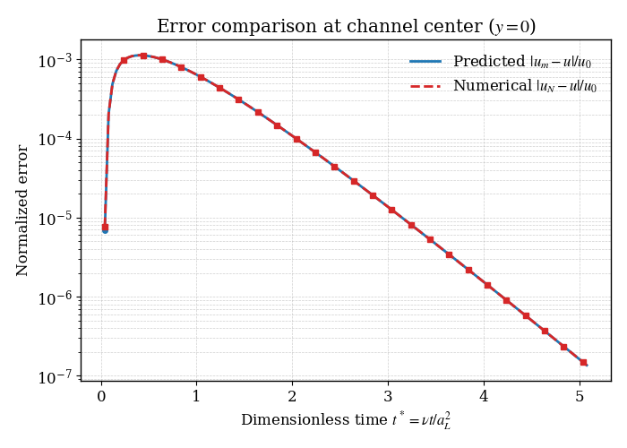
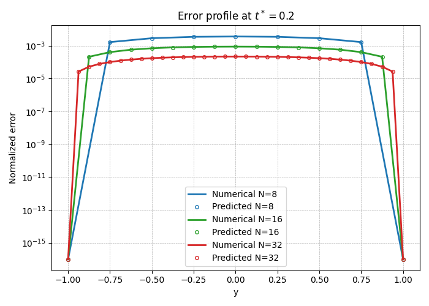
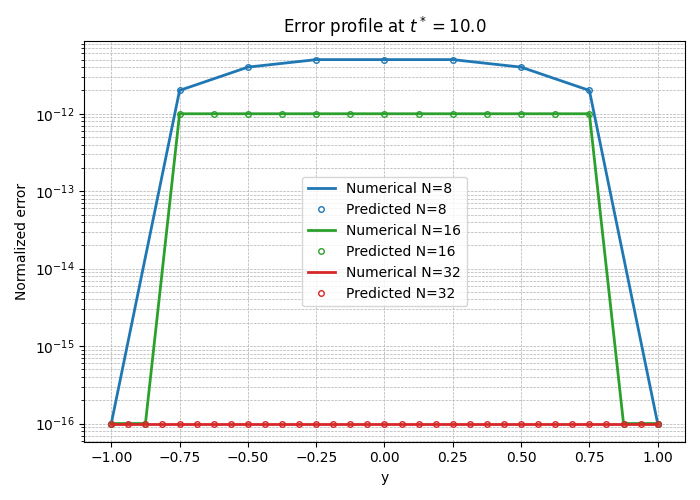
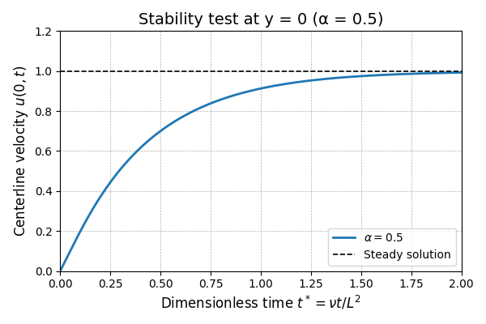
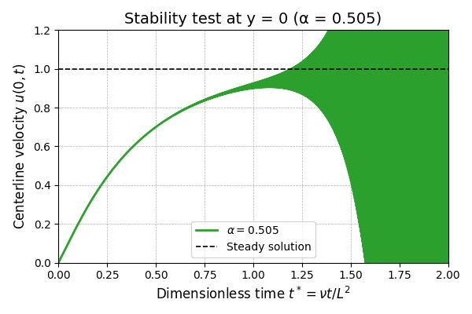
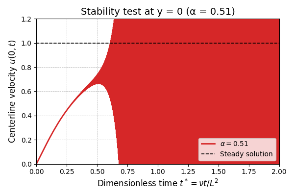
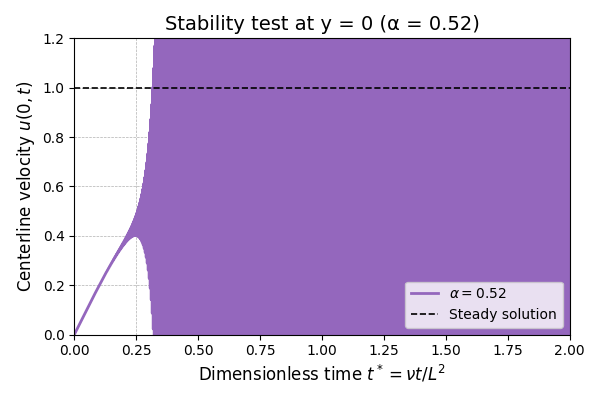

# CFD_HW_3

**姓名：梁祝旸**  
**学号：12532299**  
**课程：计算流体力学**  
**日期：2026-03-23**


## Question 11: Modified Equation & Stability Analysis
#### （a）
The code is :
```
Program main 
implicit none
! on wall implementation, center difference
! Euler time integration
!integer,parameter     :: N=32, Ntime=32
!real*8,parameter      ::  dt = 0.0125d0
!integer,parameter     :: N=16, Ntime=8
!real*8,parameter      ::  dt = 0.05d0
integer,parameter      :: N=16, Ntime=8
real*8,parameter       ::  dt = 0.05d0

real*8,parameter       :: u0=1.0d0, aL=1.0d0, anu=0.1
! u0 maximum velocity,aL channel half width,anu kinematic viscosity
! body force is then  g = 2*nu*u0/al^2
!real*8, dimension(1:N+1) :: uold, u, uana  [uana is not used, can be removed.]
real*8, dimension(1:N+1) :: uold, u
real*8                   ::theta0, theta1, theta2,theory1,theory2,ss,sss,ycc,CFL,anu_m,tt
integer                  :: j,it,nsteps,k,output_count
real*8                   :: dy,pi,t,Tend

   pi = 4.0d0*atan(1.0d0)
   dy = 2.d0*aL/real(N)
! initial condition
   u = 0.0d0
   uold = u
   CFL = dt*anu/dy/dy

   write(*,*) 'anu, dt, aL, dy, CFL=', anu, dt, aL, dy, CFL
   t = 0.d0
   Tend = 5.1d0*aL*aL/anu
   nsteps = Tend / dt
   write(*,*) 'Tend, dt, Ntime, nsteps=', Tend, dt, Ntime, nsteps

   do it=1, nsteps
  
      do j=2,N
         u(j) = uold(j) + CFL*(uold(j-1)-2.d0*uold(j)+uold(j+1)) &
                + dt*2.d0*u0*anu/aL**2.d0
      end do

      do j=2,N
         uold(j) = u(j)
      enddo

      t = t + dt
! print out solutions
      if(mod(it,Ntime).eq.0) then
! analytical solution with the same N
         output_count = output_count + 1
! assume N is even
         do j = 1,N+1
            ycc = real(j-1)*dy - 1.0d0
            theory1 = (1.d0- ycc**2.d0)
            theory2 = (1.d0- ycc**2.d0)            
! I used 100 terms
            do k =0,100
            ss = (0.5d0+real(k))*pi

            sss = 2.d0 * ss / real(N)

            anu_m = anu * (1.0d0 + (CFL/2.d0 - 1.d0/12.d0) * sss**2.d0 &
            + (CFL**2.d0/3.0d0 - CFL/12.d0 + 1.0d0/360.0d0) * sss**4.d0)

            theta0 = 4.0d0*(-1.0)**k/(pi*(real(k)+0.5d0))**3.d0
            !
            theta1 =theta0 *exp(-ss*ss*anu*t)*cos(ss*ycc)
            theta2 =theta0 *exp(-ss*ss*anu_m*t)*cos(ss*ycc)
            
            theory1 = theory1 - theta1
            theory2 = theory2 - theta2
            end do

! Write down the solution at y =0
         if(abs(ycc) < 1.d-8) then
            tt = anu * (it * dt) / (aL**2)
            write(2,100) REAL(output_count),ycc,tt,abs(theory2-theory1)/u0,abs(u(j)-theory1)/u0
         end if

         write(8,100) REAL(output_count),ycc,REAL(it),abs(theory1-u(j))/u0,abs(theory2-u(j))/u0
         end do
!!!!!!!!!!

      end if

100     format(2x, 5f16.12)
   
   enddo
end program
```
And the result is :


It shows that for 100 ***k***s, the numerical solution and  the analytical solution of the modified equation are almost the same.


#### （b）
The results are : 



The predicted errors (markers) align closely with the numerical errors (solid lines), demonstrating that the modified equation accurately captures the numerical error distribution. And the smaller the grids are, the smaller the errors will be.

#### （c）
The results are : 





If CFL=0.5 it will not diverge(in 2 dimensionless times), but as the CFL become larger, the divergence will happened earlier.


EOF