# CFD_HW_4
  
**姓名：梁祝旸**  
**学号：12532299**  
**课程：计算流体力学**  
**日期：2026-03-31**
  
  
  
## Question 12: Exact Soluton of Finite-Difference Scheme

#### （a）

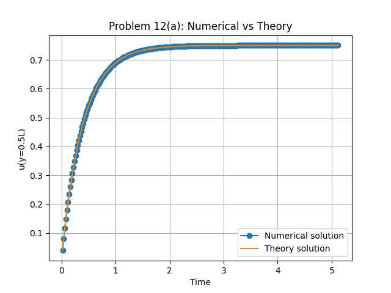
  
The plots are almost the same between the numerical solution **$u^{n}_{j}$** and the exact solution of the finite difference scheme.
  
#### （b）
The results are :
$k_{max} = 5$
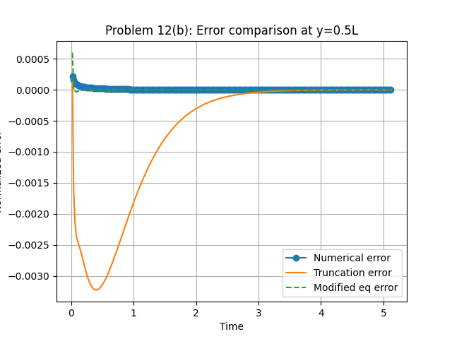
$k_{max} = 50$
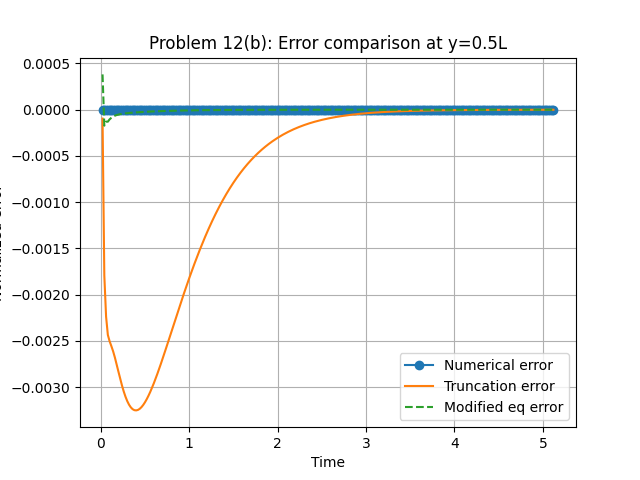
$k_{max} = 100$

The dominant source of error is not from numerical implementation but from the inherent truncation error of the finite-difference scheme.

We can find that at the beginning, different $k_{max}$ choices leed to different results. However, as the time goes, they are go to steady stats as the times go longer.

If we only compute 2 times of specific time:
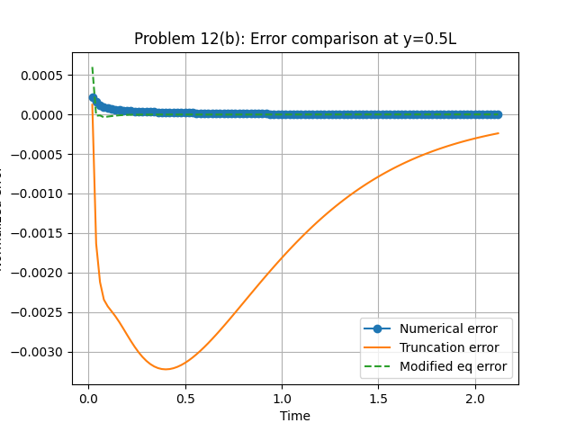

We can find the differences are at about 0 ~ 0.2.

#### （c）
The results for CFL = 0.53 in (a) are :
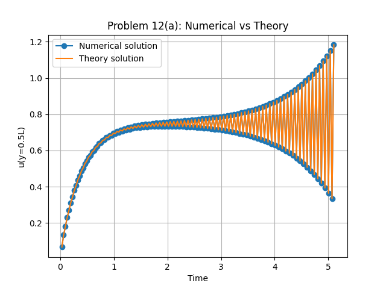

The results for CFL = 0.53 in (b) are :
$k_{max} = 5$
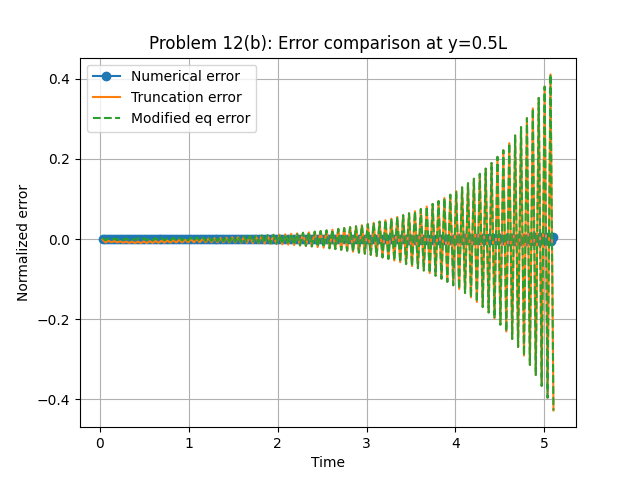
$k_{max} = 50$
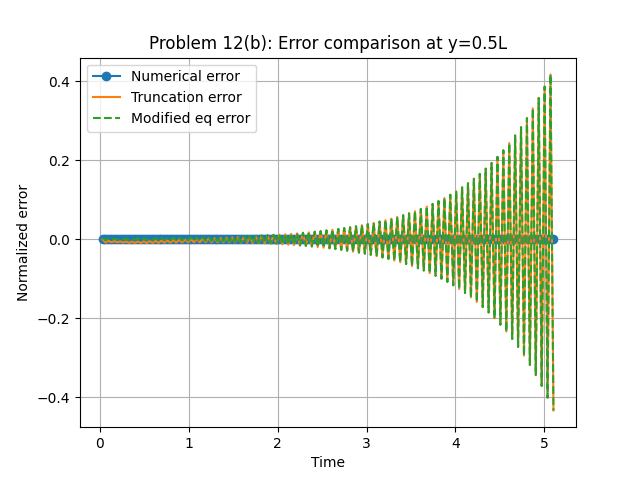
$k_{max} = 100$

Comments:
1. The numerical solution **$u^{n}_{j}$** and the exact solution of the finite difference scheme fixed very well, even if CFL>0.5(unstable). The error between these 2 solution mostly from the number of $k_{max}$.
2. Of course, as CFL>0.5, the results become not stable. But the unstable behavior **shows** clearly at about T > 2.0t.

---

## Question 13: 1D advection equation

#### （a）

We consider the 1D advection equation:

$$
\frac{\partial u}{\partial t} + a \frac{\partial u}{\partial x} = 0
$$

where \( a = 1 \).

To solve this equation, we apply the method of characteristics. The total derivative of \( u \) along a curve \( x(t) \) is:

$$
\frac{du}{dt} = \frac{\partial u}{\partial t} + \frac{dx}{dt} \frac{\partial u}{\partial x}
$$

Comparing this with the governing equation:

$$
\frac{\partial u}{\partial t} + a \frac{\partial u}{\partial x} = 0
$$

we choose the characteristic curve such that:

$$
\frac{dx}{dt} = a = 1
$$

Then,

$$
\frac{du}{dt} = 0
$$

which implies that \( u \) remains constant along the characteristic lines.
Solving:

$$
\frac{dx}{dt} = 1
$$

we obtain:

$$
x = t + C \quad \Rightarrow \quad x - t = C
$$

Thus, the solution is constant along lines:

$$
x - t = \text{constant}
$$

Since \( u \) is constant along characteristics:

$$
u(x,t) = f(x - t)
$$

The initial condition is:

$$
u(x,0) = \sin(\pi x) + 0.6\sin(3\pi x)
$$

At \( t = 0 \):

$$
u(x,0) = f(x)
$$

Therefore:

$$
f(x) = \sin(\pi x) + 0.6\sin(3\pi x)
$$

Substituting back:

$$
u(x,t) = \sin\big(\pi(x - t)\big) + 0.6\sin\big(3\pi(x - t)\big)
$$

The solution represents a wave that propagates to the right with speed \( a = 1 \) without changing its shape. This is a pure advection process.

#### （b）
The results in N = 20 :

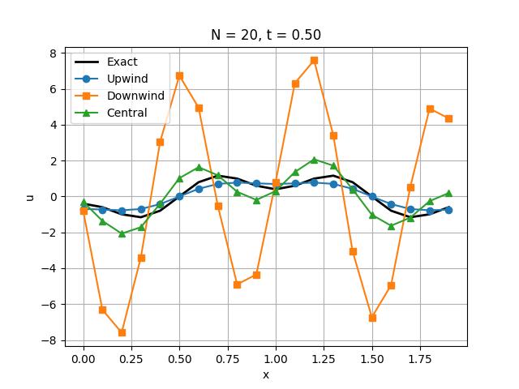
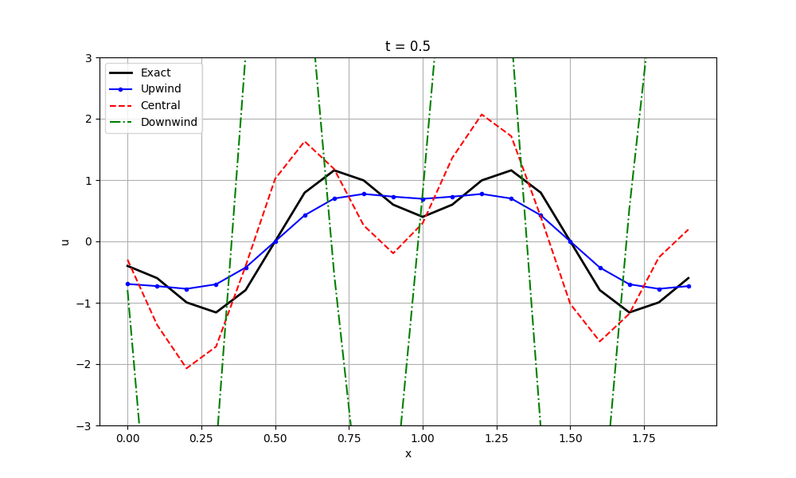
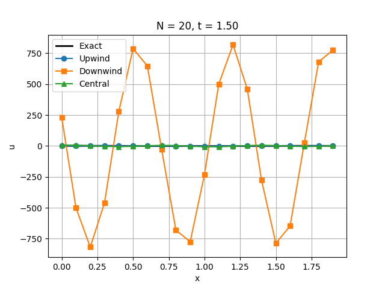

(The plots at right limit the y axis to [-3,3])

We can find :
The **downwind scheme** **diverge** at t = 0.5s(or earlier), as t =1.5 it diverges crazily.
The **central scheme** a little bit **diverges** and has a **phase angle** with the exact answer. 
The **upwind scheme** fixed best with the exact answer.

#### （c）
The results in N = 160 :

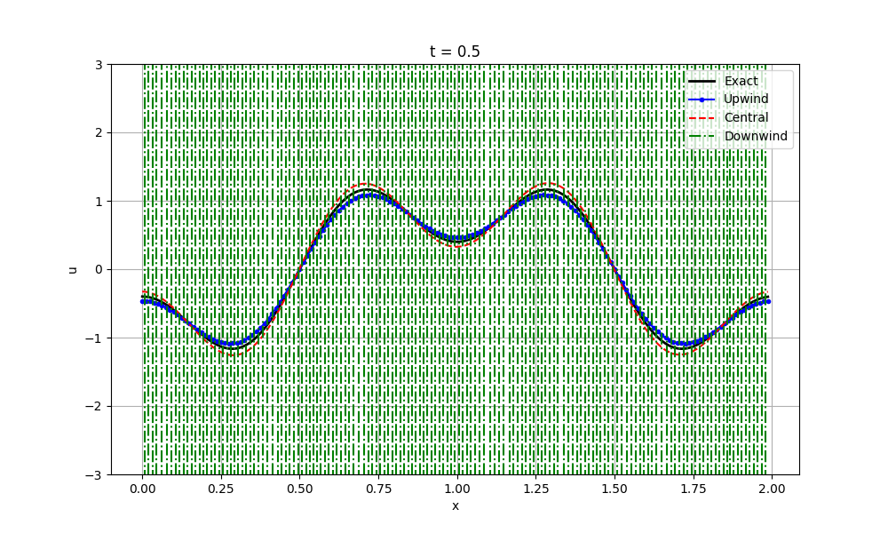
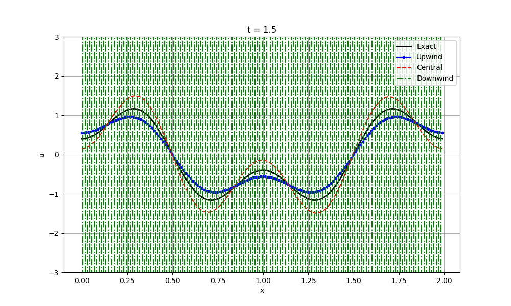

(The plots at right limit the y axis to [-3,3])

We can find :
The **downwind scheme** **diverge** at t = 0.5s(or earlier), as t =1.5 it diverges crazily.(same)
The **central scheme** a little bit **diverges** and has a **phase angle** with the exact answer. (not that clear **phase angle** at t = 1.5). And its **amplitude** become **larger**.
The **upwind scheme** fixed best with the exact answer. And its **amplitude** become **smaller**.

#### （d）
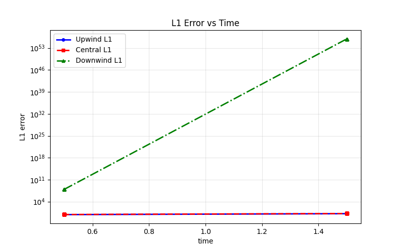
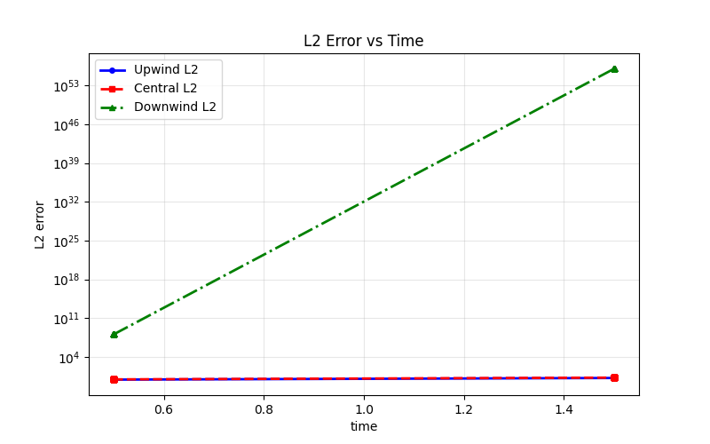

As the plots above : The **downwind scheme** get a bad error progression. While the **central scheme** and the **upwind scheme** seemed not bad, here are the detial for these two methods :

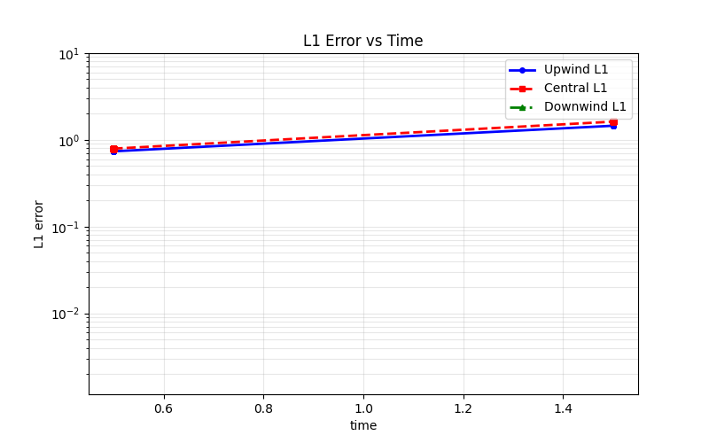
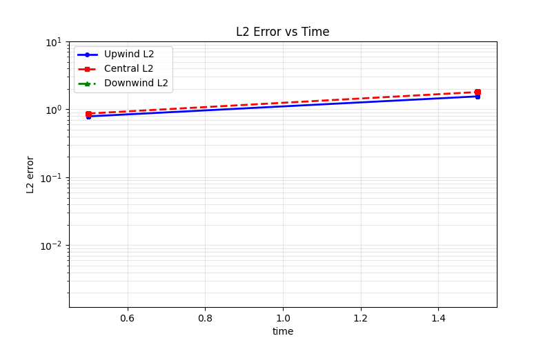

**upwind scheme** is a little bit better.
