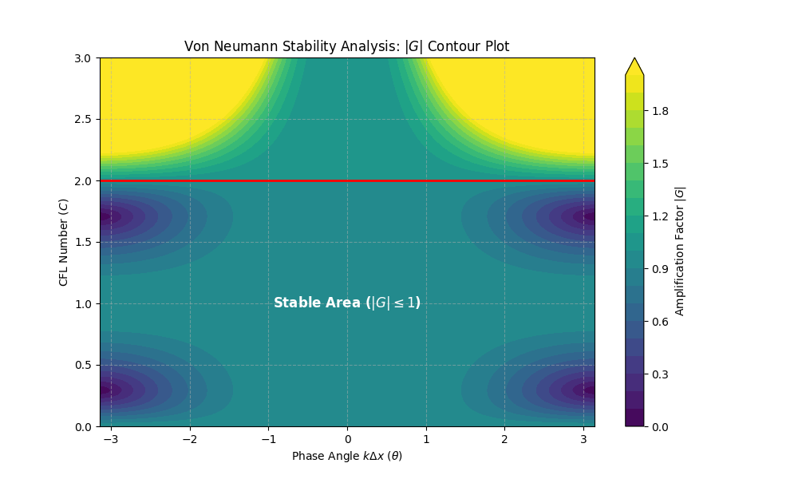

# CFD_HW_5
  
**姓名：梁祝旸**  
**学号：12532299**  
**课程：计算流体力学**  
**日期：2026-04-7**
  
  
  
## Question 14: Exact Soluton of Finite-Difference Scheme

#### （a）

The original Lagrangian interpolation scheme is given by:
$$u_{j}^{n+1}=-\frac{(\Delta x-a\Delta t)a\Delta t}{2(\Delta x)^{2}}u_{j-2}^{n}+\frac{(2\Delta x-a\Delta t)a\Delta t}{(\Delta x)^{2}}u_{j-1}^{n}+\frac{(\Delta x-a\Delta t)(2\Delta x-a\Delta t)}{2(\Delta x)^{2}}u_{j}^{n} \tag{1}$$

Let the CFL to be $C \equiv \frac{a\Delta t}{\Delta x}$:
$$u_j^{n+1} = -\frac{C(1-C)}{2} u_{j-2}^n + C(2-C) u_{j-1}^n + \frac{(1-C)(2-C)}{2} u_j^n \tag{2}$$

Rearranging in the order of $C$:
$$u_j^{n+1} - u_j^n = -\frac{C}{2} [3u_j^n - 4u_{j-1}^n + u_{j-2}^n] + \frac{C^2}{2} [u_{j-2}^n - 2u_{j-1}^n + u_j^n] \tag{3}$$

Divide both sides by $\Delta t$ and substitute $C = \frac{a\Delta t}{\Delta x}$ back into the equation:
$$\frac{u_j^{n+1} - u_j^n}{\Delta t} = -\frac{a}{2\Delta x} [3u_j^n - 4u_{j-1}^n + u_{j-2}^n] + \frac{a^2 \Delta t}{2(\Delta x)^2} [u_{j-2}^n - 2u_{j-1}^n + u_j^n] \tag{4}$$

Rearranging the spatial derivative term to the left side yields the target equation:
$$\frac{u_j^{n+1} - u_j^n}{\Delta t} + \frac{a}{2\Delta x} [3u_j^n - 4u_{j-1}^n + u_{j-2}^n] = \frac{a^2 \Delta t}{2} \frac{[u_{j-2}^n - 2u_{j-1}^n + u_j^n]}{(\Delta x)^2} \tag{5}$$

#### （b）

To perform the von Neumann stability analysis, we assume a discrete Fourier mode for the numerical solution:
$$u_j^n = G^n e^{i j \theta} \tag{6}$$

where $G$ is the amplification factor, $\theta = k\Delta x$ is the phase angle, and $i = \sqrt{-1}$.

Substituting this into $(2)$:
$$G = \frac{C(C-1)}{2} e^{-i 2\theta} + C(2-C) e^{-i \theta} + \frac{(C-1)(C-2)}{2} \tag{7}$$

Using Euler's formula $e^{-i\theta} = \cos\theta - i\sin\theta$, we can separate $G$ into its real part ($G_R$) and imaginary part ($G_I$):

$$
G_R = \frac{C(C-1)}{2} \cos(2\theta) + C(2-C) \cos\theta + \frac{(C-1)(C-2)}{2}
 \tag{8.1}
$$

$$
G_I = -\frac{C(C-1)}{2} \sin(2\theta) - C(2-C) \sin\theta
 \tag{8.2}
$$

The magnitude of the amplification factor is $|G| = \sqrt{G_R^2 + G_I^2}$.

  

