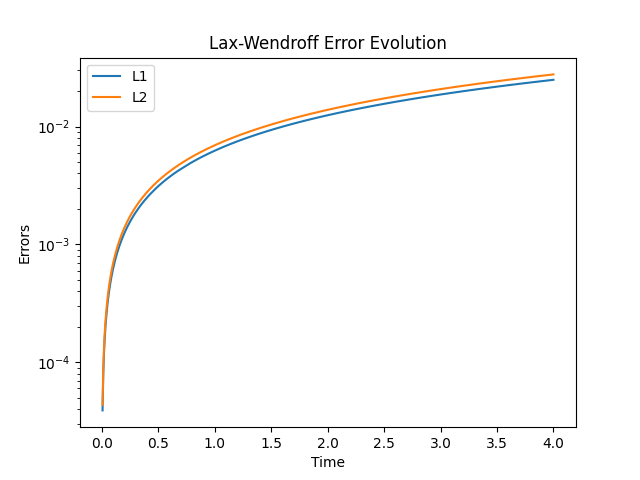
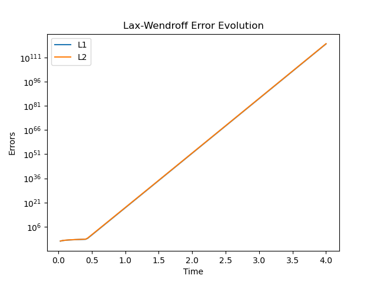
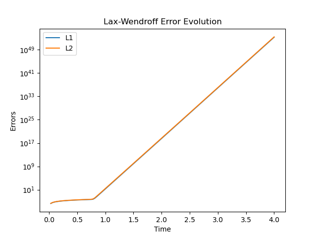

# CFD_HW_6
  
**姓名：梁祝旸**  
**学号：12532299**  
**课程：计算流体力学**  
**日期：2026-04-26**

---

# **17. Lax–Wendroff Scheme**

---

## **(a) von Neumann Stability Analysis**

The Lax–Wendroff scheme is:

$$
u_j^{n+1} = u_j^n - \frac{a\Delta t}{2\Delta x}(u_{j+1}^n - u_{j-1}^n) + \frac{a^2 \Delta t^2}{2\Delta x^2}(u_{j+1}^n - 2u_j^n + u_{j-1}^n)
$$

Assume Fourier mode:

$$
u_j^n = {e}^{\sigma n \Delta t} e^{i k j \Delta x}
$$

Substitute into the scheme:

$$
{e}^{\sigma \Delta t} = 1 - iC \sin\theta + C^2 (\cos\theta - 1)
$$

where:

$$
C = \frac{a\Delta t}{\Delta x}, \quad \theta = k\Delta x
$$

Magnitude:

$$
|{e}^{\sigma \Delta t}|^2 = [1 + C^2(\cos\theta - 1)]^2 + (C\sin\theta)^2
$$

Simplified result:

$$
|{e}^{\sigma \Delta t}|^2 = 1 - C^2(1 - C^2)\sin^2\theta \le 1
$$

Thus:

$$
\boxed{|C| \le 1}
$$

---

## **(b) Modified Equation**

Time expansion:

$$
u_j^{n+1} = u + \Delta t u_t + \frac{\Delta t^2}{2}u_{tt} + \frac{\Delta t^3}{6}u_{ttt} + \frac{\Delta t^4}{24}u_{tttt} +\cdots
$$

Space expansion:

$$ u_{j\pm1} = u \pm \Delta x u_x + \frac{\Delta x^2}{2}u_{xx} \pm \frac{\Delta x^3}{6}u_{xxx} + \frac{\Delta x^4}{24}u_{xxxx} \pm \cdots $$

The modified equation:

$$
u_t  +au_x= -\frac{\Delta t}{2}u_{tt} - \frac{\Delta t^2}{6}u_{ttt} - \frac{a\Delta x^2}{6}u_{xxx}+ \frac{a^2\Delta t}{2}u_{xx}+ \frac{a^2\Delta t \Delta x^2}{24}u_{xxxx} - \frac{\Delta t^3}{24}u_{tttt} + O(\Delta x^4, \Delta t^4)
$$

Using:

$$
\quad u_{ttt} = -a^3 u_{xxx} \quad u_{tttt} = a^4 u_{xxxx}
$$

Final modified equation:

$$
u_t + a u_x =
\frac{a(\Delta x)^2}{6}(C^2 - 1) u_{xxx}+ \frac{a(\Delta x)^3}{8}C(1 - C^2) u_{xxxx}+ \cdots
$$

Coefficients:

$$
C_1 = 0
$$

$$
C_2 = \frac{1}{6}(C^2 - 1)
$$

$$
C_3 = \frac{1}{8}C(1 - C^2)
$$

---

## **(c) Python Code for Error Evolution**

---

# **18. Scheme B (Upwind Slope)**

---

## **(a) Stability Analysis**

$$
u_j^{n+1} =u_j^n - C(u_j^n - u_{j-1}^n)- \frac{C(1-C)}{2}(u_j^n - 2u_{j-1}^n + u_{j-2}^n)
$$

Amplification factor:

$$
{e}^{\sigma \Delta t} = 1 - C(1 - e^{-i\theta}) - \frac{C(1-C)}{2}(1 - e^{-i\theta})^2
$$

Simplified result:

$$
|{e}^{\sigma \Delta t}|^2 = 1 - C(1 - C)^2(2-C)(1-\cos\theta)^2 \le 1
$$

Stability condition:

$$
\boxed{|C| \le 2}
$$

---

## **(b) Modified Equation**

Time expansion:

$$
u_j^{n+1} = u + \Delta t u_t + \frac{\Delta t^2}{2}u_{tt} + \frac{\Delta t^3}{6}u_{ttt} + \frac{\Delta t^4}{24}u_{tttt} +\cdots
$$

Space expansion:

$$ u_{j-1} = u - \Delta x u_x + \frac{\Delta x^2}{2}u_{xx} - \frac{\Delta x^3}{6}u_{xxx} + \frac{\Delta x^4}{24}u_{xxxx} - \cdots $$

$$ u_{j-2} = u - 2\Delta x u_x + \frac{(2\Delta x)^2}{2}u_{xx} - \frac{(2\Delta x)^3}{6}u_{xxx} + \frac{(2\Delta x)^4}{24}u_{xxxx} - \cdots $$

The modified equation:

$$
u_t + a u_x= - \frac{\Delta t}{2}u_{tt}- \frac{\Delta t^2}{6}u_{ttt}- \frac{\Delta t^3}{24}u_{tttt} \\+ \frac{a\Delta x^2}{2}Cu_{xx}+ a\Delta x^2(\frac{1}{3}-\frac{1}{2}C)u_{xxx}+ a\Delta x^3(-\frac{1}{4}-\frac{7}{24}C)u_{xxxx}+ O(\Delta x^4,\Delta t^4)
$$

Using:

$$
\quad u_{ttt} = -a^3 u_{xxx} \quad u_{tttt} = a^4 u_{xxxx}
$$

Final modified equation

$$
u_t + a u_x =\frac{1}{6}(1 - C)(2 - C) u_{xxx}+ \frac{1}{8}(1 - C)^2(2 - C)u_{xxxx}+ \cdots
$$

Coefficients:

$$
C_1 = 0
$$

$$
C_2 = \frac{1}{6}(1 - C)(2 - C)
$$

$$
C_3 = \frac{1}{8}(1 - C)^2(2 - C)
$$

---

## **(c) Python Code for Error Evolution**

No clear different with 17.(C)

If we wont the results like question 13, try change C to be 2.5:

---

# **EOF**

