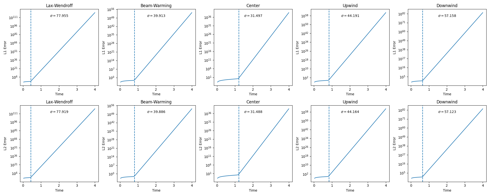
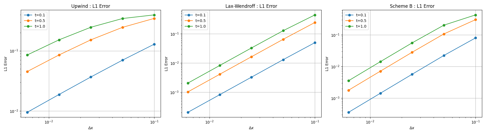
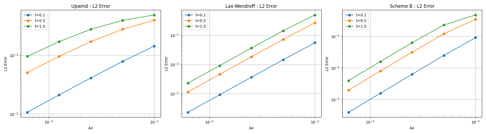
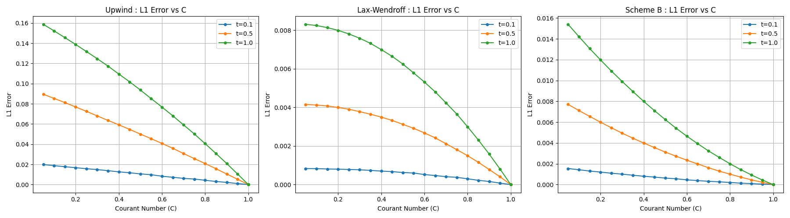
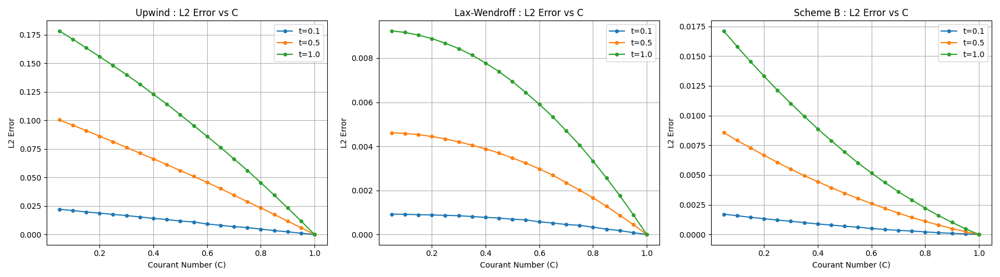

# CFD_HW_7
  
**姓名：梁祝旸**  
**学号：12532299**  
**课程：计算流体力学**  
**日期：2026-05-10**

---

# **19. Error Slopes**

---

## **(a) & (b)**

The answer for (a) and (b) are all below:

The slope marks I use " $\sigma$ " has reason which will be explained in (c).

---

## **(c) Predict the slope**

#### Interpretation of the Error Growth Rate σ

#### 1. Exponential error growth

For numerical solutions of the linear advection equation, the error often evolves as:

$$
e(t) = u_{\text{num}}(t) - u_{\text{exact}}(t)
$$

In unstable or marginally stable regimes, the error exhibits exponential behavior:

$$
e(t) \sim e^{\sigma t}
$$

Taking the logarithm:

$$
\log |e(t)| \sim \sigma t
$$

Thus, the slope of the log-error curve is the growth rate σ.

#### 2. Explaination 

Using von Neumann analysis for the errors:

$$
e^n_j = e^{\sigma t} e^{ikj\Delta x}
$$

And in L1 or L2 :

$$
L1(t) =\frac{1}{N} \sum_j |e_j(t)| \approx \frac{1}{N} |e^{\sigma t}| \sum_j |e^{ikj\Delta x}| = C_1 e^{\sigma t}
$$

$$
L2(t) = L2(t) = \sqrt{\frac{1}{N} \sum_j e_j(t)^2} \approx |e^{\sigma t}| \sqrt{\frac{1}{N} \sum_j{e^{ikj\Delta x}}^2} = C_2 e^{\sigma t}
$$

And in the plots, the y-axis is log mod:

$$
\log{L1(t)} = \sigma t + \log{C1}
$$

$$
\log{L2(t)} = \sigma t + \log{C2}
$$

Therefore:

$$
\frac{d}{dt}\log(L1) = \frac{d}{dt}\log(L2) = \sigma
$$

#### σ and CFL (C = 2.5) for different schemes

For linear advection with periodic boundary conditions:

$$
u(x,t=0)=\sin(\pi x)+0.6\sin(3\pi x), \quad x\in[0,2]
$$

the discrete error evolution follows:

$$
\sigma(k)=\frac{1}{\Delta t}\ln|G(C,k\Delta x)|
$$

where we consider G by von Neumann analysis:

$$
G(C,k\Delta x) = |e^{\sigma t}|
$$

with:
$$
C = \frac{a\Delta t}{\Delta x} = 2.5
$$

Grid resolution:
$$
\Delta x = \frac{2}{N} = \frac{2}{160}=0.0125
$$

So:
- \(k_1 = \pi \Rightarrow k_1\Delta x \approx 0.0393\)
- \(k_2 = 3\pi \Rightarrow k_2\Delta x \approx 0.1180\)

Dominant growth rate:
$$
\sigma = \max(\sigma_{k_1}, \sigma_{k_2})
$$

---

#### 1. Upwind scheme

Small-k approximation:
$$
G \approx 1 - C(1 - e^{-ik\Delta x})
$$

Estimated growth:
- for \(k_1\): weak growth
- for \(k_2\): stronger growth

At \(C=2.5\):
$$
\sigma \approx \frac{1}{\Delta t}\ln(1.8\sim2.2) \approx 40 \sim 70
$$

---

#### 2. Lax–Wendroff

$$
G = 1 - iC\sin(k\Delta x) + C^2(\cos(k\Delta x)-1)
$$

Small-angle approximation:
- dispersive amplification dominates when \(C>1\)

Estimated:
$$
|G| \approx 1.3 \sim 1.6
$$

$$
\sigma \approx \frac{1}{\Delta t}\ln(1.3\sim1.6) \approx 15 \sim 40
$$

---

#### 3. Beam–Warming

Second-order upwind bias → stronger CFL sensitivity

$$
G = 1 - C(1 - e^{-ik\Delta x}) - \frac{C(1-C)}{2}(1 - e^{-ik\Delta x})^2
$$

At \(C=2.5\):
$$
|G| \approx 1.5 \sim 2.0
$$

Estimated:
$$
\sigma \approx 25 \sim 60
$$

---

#### 4. Centered scheme

$$
G = 1 - iC\sin(k\Delta x)
$$

Magnitude:
$$
|G| = \sqrt{1 + C^2\sin^2(k\Delta x)}
$$

For small \(k\Delta x\):

$$
|G| \approx 1 + \frac{1}{2}C^2(k\Delta x)^2
$$

Estimated:
$$
|G| \approx 1.01 \sim 1.03
$$

$$
\sigma \approx 5 \sim 15
$$

---

#### 5. Downwind scheme

$$
G = 1 + C(1 - e^{-ik\Delta x})
$$

Strong amplification:

$$
|G| \approx 2.5 \sim 3.5
$$

Estimated:
$$
\sigma \approx 50 \sim 90
$$

---

#### Summary (C = 2.5)

| Scheme        | Estimated σ range |
|--------------|------------------|
| Upwind       | 40 ~ 70          |
| Lax–Wendroff | 15 ~ 40          |
| Beam–Warming | 25 ~ 60          |
| Center       | 5 ~ 15           |
| Downwind     | 50 ~ 90          |

---

# **20. Error Slopes**

---

## **(a) The effect of Leading-edge trunction error**

#### 1. Upwind Scheme

The modified equation is :

$$
u_t + a u_x = \frac{a\Delta x}{2}(1-C)u_{xx} + O(\Delta x^2)
$$

The Leading-edge Trunction Error is : 

$$
\text{LTE}\sim(1-C)\Delta x
$$

Properties:

- First-order accurate
- Dominated by numerical diffusion
- Error decreases as \( C \to 1 \)

---

#### 2. Lax–Wendroff Scheme

The modified equation is :

$$
u_t + a u_x =
\frac{a(\Delta x)^2}{6}(C^2 - 1) u_{xxx}+ \frac{a(\Delta x)^3}{8}C(1 - C^2) u_{xxxx}+ \cdots
$$

The Leading-edge Trunction Error is : 

$$
\text{LTE}\sim(C^2 - 1)(\Delta x)^2
$$

Properties:

- Second-order accurate
- Dominated by dispersive error
- Error decreases significantly as \( C \to 1 \)

---

#### 3. Scheme B

The modified equation is :

$$
u_t + a u_x =\frac{{a\Delta x^2}}{6}(1 - C)(2 - C) u_{xxx} +  \cdots
$$

The Leading-edge Trunction Error is : 

$$
\text{LTE}\sim(1 - C)(2 - C)(\Delta x)^2
$$

Properties:

- Second-order accurate
- Mainly dispersive
- Error decreases significantly as \( C \to 1 \) and \( C \to 2 \)
- More stable and less oscillatory than Lax–Wendroff

---

## **(b) Varied by $ \Delta x $**

---

## **(c) Varied by $ C $**

---

## **(d) Prediction**

---

#### 1. For (b), The orde of $ \Delta x $ represent the slope of the plots.

Because the Courant number $C$ is fixed at $0.1$, the $C$-dependent terms become constants. The truncation error is entirely governed by the spatial step size, $\Delta x$.

* **Upwind Scheme:** The error is proportional to $\Delta x^1$. 
  * **Prediction:** On a log-log plot, the L1 and L2 error curves will show a linear decrease with a **slope of 1**, demonstrating first-order spatial accuracy.
* **Lax-Wendroff Scheme:** The error is proportional to $\Delta x^2$. 
  * **Prediction:** On a log-log plot, the error curves will decline more steeply with a **slope of 2**, demonstrating second-order spatial accuracy.
* **Scheme B:** The error is also proportional to $\Delta x^2$. 
  * **Prediction:** On a log-log plot, the curves will also exhibit a **slope of 2**. However, because the coefficient $(1-C)(2-C)$ differs from the Lax-Wendroff coefficient $(1-C^2)$ when $C=0.1$, the Scheme B curve will be parallel to the Lax-Wendroff curve but with a different vertical intercept.

#### 2. For (c), $ C $ represent the shape of the plots.

Because the grid size $N$ (and therefore $\Delta x$) is fixed, the spatial component of the error term acts as a constant. The error variation is entirely driven by how the $C$-dependent coefficient changes as $0 < C \le 1.0$.

* **Upwind Scheme:** The error coefficient is proportional to $(1 - C)$. 
  * **Prediction:** On a standard linear plot, the error will show a **linear decrease** as $C$ increases from $0$ toward $1$.
* **Lax-Wendroff Scheme:** The error coefficient is proportional to $(1 - C^2)$. 
  * **Prediction:** The error will exhibit a **parabolic (quadratic) decay** as $C$ increases.
* **Scheme B:** The error coefficient is proportional to $(1 - C)(2 - C)$. 
  * **Prediction:** The error will also trace a **quadratic decay curve** over the interval $0 < C \le 1.0$.

#### 3. For (b) and (c), the several representative times shows how the Leading-edge Trunction Error influence the L1 and L2 error.

Short-term errors are governed by the scheme's formal "order of accuracy," but long-term results are ruined by cumulative dissipation, dispersion, and boundary interference.

---
# **EOF**

